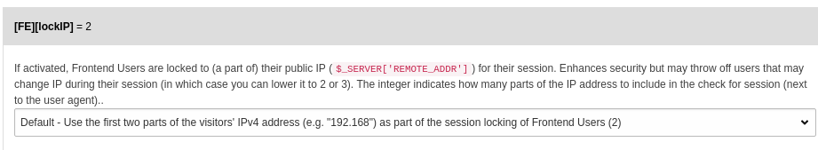

.. include:: ../Includes.txt

.. _decomposed-config-overview:

======================
Configuration Overview
======================

This chapter will give you a brief overview of various configuration
methods in TYPO3. For more detail, follow the respective link under
“More information”.

A primary feature of TYPO3 is its configurability. Not only can
it be configured by users with special user privileges in the Backend,
most configuration can also be overridden by source code in extensions
or configuration files (e.g. AdditionalConfiguration.php).
This makes the changes easily maintainable and suited for a revision
control system (e.g. git), automatic testing and deployment.

This page attempts to classify the various methods, give some
examples what is used where and answer some common questions.

.. _decomposed-config-classification:

Classification
==============

In general, a configuration method consists of:

#. The **configuration language (syntax)** (e.g. PHP, TypoScript, XML or Yaml)
#. The **configuration schema** which defines which properties can be
   filled with which types of values
#. A **configuration setting method** determines how the properties are
   filled with values, for example by providing a PHP or Yaml file or
   selecting options in the Global Configuration section in the Backend.
#. **Configuration persistence** is where the configuration is stored,
   for example filenames (e.g. `typo3conf/LocalConfiguration.php`) or
   which tables and fields are used for storage in the database (e.g.
   `tt_content.pi_flexform` for FlexForm)
#. **Scope**: To what the configuration applies. Is it global, does
   it only affect a specific extension, only a specific page tree
   or user group etc.
#. **Privileges**: By whom can the configuration be changed
   (e.g. developer only or system maintainer, admin, editor)

In the case of TypoScript, the name of the method is the same as the name
of the configuration language TypoScript, which defines the syntax.

What is used where?
===================

Very roughly, these are the available configuration methods used by TYPO3:

* :ref:`Global Configuration <decomposed-config-global-configuration>`
  is used for system wide configuration. It mostly
  affects the core.
* :ref:`Extension Configuration <decomposed-config-extconf>` is used for
  configuration changes specific to one extension
* :ref:`TSconfig <decomposed-config-tsconfig>` is used in TYPO3 to
  configure and customize the backend on a page (page TSconfig)
  and a user or group basis (user TSconfig). The configuration language that is used is
  TypoScript, but the configuration options that can be set with TSconfig and TypoScript
  differ.
* :ref:`TypoScript <decomposed-config-method-typoscript>` is used to configure
  plugins (FE) and modules (BE), as well as some
  global settings (config). It is also used to define the rendering, but that is
  beyond the scope of this page, which focuses only on configuration. TypoScript
  is mostly used for configuration that affects the Frontend (FE).
* :ref:`TypoScript constants <decomposed-config-method-typoscript-constants>` are
  used as variables for TypoScript
* :ref:`TCA <decomposed-config-tca>` is specific to database fields and
  how they behave and can be edited in the Backend.
* :ref:`Flexform <decomposed-config-flexform>` is used to configure plugins in the Backend.
* :ref:`Feature toggles <decomposed-config-feature-toggles>` turn specific TYPO3 features
  on / off. One can argue whether this is a
  configuration method, but it does have a similar effect as turning a boolean value in
  the Global Configuration on or off and the result is written to the same array as
  the Global Configuration ($GLOBAL['TYPO3_CONF_VARS').

Languages used by TYPO3 for configuration:

* :ref:`TypoScript syntax <decomposed-config-lang-typoscript>` is used for TypoScript
  and TSconfig
* :ref:`TypoScript constant syntax <decomposed-config-lang-typoscript-constants>` is
  used for Extension Configuration and for defining constants for TypoScript
* :ref:`Symfony Expression Language <decomposed-config-lang-symfony-expressionlang>`
  is used as language for TypoScript conditions since TYPO3 9.4
* :ref:`Yaml <decomposed-config-lang-yaml>` is the configuration language of choice for newer TYPO3 system extensions
  like rte_ckeditor, form and the sites module. It has partly replaced TypoScript
  and TSconfig as configuration languages. Yaml is not a configuration method, it
  is a configuration language, but we include it here for the sake of completeness.
  How Yaml is used, the available fields and filenames is defined by the respective
  extension using this format.
* XML is used in FlexForms

Extend configuration
--------------------

The following are configuration methods, where the configuration schema (definition of
properties, value types and default values) can be created or extended by developers:

* TSconfig
* TypoScript
* Extension Configuration
* Flexform

The following are configuration methods, where the configuration schema should only
be extended by core developers:

* Global Configuration
* Feature toggles

Change values
-------------

For the following configuration methods, values can be changed in the BE:

* Global Configuration
* Extension Configuration
* TypoScript (though it is recommended to maintain TypoScript in a site package extension)
* TSconfig (though it is recommended to maintain TSconfig in a site package extension)
* Flexform
* Feature toggles

For the following configuration methods, values can only be changed by source code (typically
in the core or an extension):

* TCA

.. _decomposed-config-methods:

Configuration methods
=====================

.. _decomposed-config-global-configuration:

Global Configuration
--------------------

.. rst-class:: dl-parameters

Global Configuration
   :sep:`|` :aspect:`Schema Language:` Yaml
   :sep:`|` :aspect:`Language:` PHP
   :sep:`|` :aspect:`Scope:` global
   :sep:`|` :aspect:`Extendable:` core
   :sep:`|` :aspect:`Required privilege:` system maintainer

.. rst-class:: clear

Description:
   `$GLOBALS['TYPO3_CONF_VARS']` PHP array.

Used for:
   System wide global configuration.

Schema:
   * Default values `typo3/sysext/core/Configuration/DefaultConfiguration.php`
   * Description + Definition: `typo3/sysext/core/Configuration/DefaultConfigurationDescription.yaml`

Change values in:
   * Backend: *Settings* >> *Configure Installation-Wide Options*
   * Files: `typo3conf/AdditionalConfiguration.php`

View in:
    Backend: *Configuration* >> *Global Configuration*

Automatically generated file:
   `typo3conf/LocalConfiguration.php`

Example:
   Change value `$GLOBALS['TYPO3_CONF_VARS']['FE']'lockIP']`:

More information:
  * :ref:`Global Configuration <typo3ConfVars>`
  * :ref:`t3start:system-modules-configuration` in "Getting Started"
  * The :ref:`Caching Framework <caching>` can be configured by setting
    `$GLOBAL['TYPO3_CONF_VARS']['SYS']['caching']` in `AdditionalConfiguration.php`
    or `LocalConfiguration.php`, but not in the here mentioned Backend module
    "Settings". See :ref:`caching-configuration-cache`.

.. _decomposed-config-extconf:

Extension Configuration
-----------------------

.. rst-class:: dl-parameters

Global Configuration
   :sep:`|` :aspect:`Schema Language:` TypoScript constants
   :sep:`|` :aspect:`Language:` PHP
   :sep:`|` :aspect:`Scope:` extension
   :sep:`|` :aspect:`Extendable:` no
   :sep:`|` :aspect:`Required privilege:` system maintainer

.. rst-class:: clear

Description:
   * `$GLOBALS['TYPO3_CONF_VARS']['EXT']['EXTENSION']` PHP array.
   * Typically, configuration defined in `ext_conf_template.txt`
     consists of 1 line schema and label, which defined the type
     (e.g. string) and one line assignment for each property.

Used for:
   Configuration specific to an extension. 

Schema:
   Definition, description and default values in file `<extkey>/ext_conf_template.txt`

Change values in:
   Backend: *Settings* >> *Extension Configuration*

Automatically generated:
   yes, `typo3conf/LocalConfiguration.php`

Example:
   Configuration of system extension "backend".

   .. code-block:: typoscript

      # cat=Login; type=string; label=LLL:EXT:backend/Resources/Private/Language/locallang.xlf:config.loginLogo
      loginLogo =

      # cat=Login; type=color; label=LLL:EXT:backend/Resources/Private/Language/locallang.xlf:config.loginHighlightColor
      loginHighlightColor =

      # cat=Login; type=string; label=LLL:EXT:backend/Resources/Private/Language/locallang.xlf:config.loginBackgroundImage
      loginBackgroundImage =

      # cat=Login; type=string; label=LLL:EXT:backend/Resources/Private/Language/locallang.xlf:config.loginFootnote
      loginFootnote =

      # cat=Backend; type=string; label=LLL:EXT:backend/Resources/Private/Language/locallang.xlf:config.backendLogo
      backendLogo =

      # cat=Backend; type=string; label=LLL:EXT:backend/Resources/Private/Language/locallang.xlf:config.backendFavicon
      backendFavicon =

More information:
   * :ref:`extension-reserved-filenames`
   * :ref:`extension-options`
   * :ref:`Constant comment syntax <t3tsref:typoscript-syntax-constant-editor-comments>`

.. _decomposed-config-tca:

TCA
---

.. rst-class:: dl-parameters

TCA
   :sep:`|` :aspect:`Language:` PHP
   :sep:`|` :aspect:`Scope:` global
   :sep:`|` :aspect:`Extendable:` core, extensions
   :sep:`|` :aspect:`Required privilege:` no modifications in BE possible, developer only

.. rst-class:: clear

Description:
   * Table configuration array
   * PHP array `$GLOBALS['TCA']`

Used for:
   Change behaviour of database fields in the Backend.

Schema:
   * none, the schema is implicitly defined by filling the $GLOBALS['TCA'] array
   * Default values in `<extkey>/Configuration/TCA`

Change values in:
   `<extkey>/Configuration/TCA/Overrides`

Example:
   Field 'link' is defined to be an input field (type='input') of renderType
   'inputLink' which adds button to open link wizard when editing this field
   in the Backend.

   .. code-block:: php

       'link' => array(
            'exclude' => 1,
            'label' => 'Link',
            'config' => array(
                'type' => 'input',
                'renderType' => 'inputLink',
            ),
        ),

   .. image:: ../Images/Decomposed/linkwizard.png
      :class: with-shadow

   See :ref:`t3tca:start` for more examples, for example :ref:`t3tca:columns-input-examples`
   for examples for input fields.

More information:
  * :ref:`extending`
  * :ref:`t3tca:start`

.. _decomposed-config-method-typoscript:

TypoScript configuration method
-------------------------------

.. rst-class:: dl-parameters

TypoScript
   :sep:`|` :aspect:`Schema Language:` none
   :sep:`|` :aspect:`Language:` TypoScript
   :sep:`|` :aspect:`Scope:` can be global or specific to pages
   :sep:`|` :aspect:`Extendable:` core, extensions
   :sep:`|` :aspect:`Required privilege:` admin

.. rst-class:: clear

.. important:: In the context of the classification used on this page, TypoScript is a
   configuration language **and** configuration method: The configuration language TypoScript
   can be used in TSconfig and TypoScript. A syntax variant, TypoScript constants is used in
   Extension Configuration and TypoScript constants.

Description:
    TypoScript is a configuration method that uses the configuration language TypoScript.

Used for:
    Configuration of plugins (Frontend), Modules (Backend) and some global configuration
    used in the Frontend (:ref:`config. <tsref:config>`).

Schema:
   * none
   * Default values `<extkey>/Configuration/TypoScript`, typically in file setup.txt or
     setup.typoscript

Change values in:
   * Backend: *Template* >> *Info / Modify*
   * Files: *<extkey>/Configuration/TypoScript/*

View in:
    Backend: *Template* : *TypoScript Object Browser*

.. todo: Example:

More information:
   * :ref:`decomposed-config-lang-typoscript` on this page
   * :ref:`TypoScript reference <tsref:start>`

.. _decomposed-config-method-typoscript-constants:

TypoScript constants
--------------------

Constants are a subset of TypoScript. The syntax is very similar. This can lead to confusion because
the variables are often named similar, but constants and TypoScript setup are changed in different
places. By using constants, the TypoScript can be kept general and later simply be configured differently
by changing constants.

The constants have no effect by themselves. They are used in TypoScript setup as variables.

For example:

constant:

.. code-block:: none

    plugin.tx_extkey.form.spamCheck = default

Setup uses the constant:

.. code-block:: none

   plugin.tx_extkey.settings.form.spamCheck = {$plugin.tx_extkey.spamCheck}

Before each constant assignment, you can optionally add a descriptive line that defines the data
type and adds a category and label. This is used in the contant editor.

Example:

.. code-block:: none

   # cat=plugin.tx_extkey/form; type=string; label=Configure spam checking (default|captcha|none)
   plugin.tx_extkey.form.spamCheck = default

More information:
   * :ref:`Constant comment syntax <t3tsref:typoscript-syntax-constant-editor-comments>`

.. _decomposed-config-tsconfig:

TSconfig
--------

.. rst-class:: dl-parameters

TSconfig
   :sep:`|` :aspect:`Schema Language:` none
   :sep:`|` :aspect:`Language:` TypoScript
   :sep:`|` :aspect:`Scope:` specific to pages, Backend users or Backend groups
   :sep:`|` :aspect:`Extendable:` core
   :sep:`|` :aspect:`Required privilege:` admin

.. rst-class:: clear

Description:
   Can be used to configure the Backend. Values can be modified in the Backend or
   in an extension, by supplying configuration files.

What is it used for:
   TSconfig is used in TYPO3 to configure and customize the backend on a page
   and a user or group basis.

Schema:
   * none
   * Default values `<extkey>/Configuration/TypoScript`, typically in file setup.txt or
     setup.typoscript

Change values in (Page TSconfig):
   * Page TSconfig

     * Backend: *Page properties* >> *Resources* >> *Page TSconfig*
     * Files: `<extkey>/Configuration/TSconfig/`

   * User TSconfig

     * Backend: *Backend users* >> Select *Backend users* in Combobox >> Edit user >> *Options* >> *TSconfig*
     * Backend: *Backend users* >> Select *Backend user groups* in Combobox >> Edit group >> *Options* >> *TSconfig*
     * Files in `<extkey>/Configuration/TSConfig`

View in:
    To view Page TSconfig, use Backend: :guilabel:`"WEB" > "Info" > "Page TSconfig"`

.. todo: Example:

More information:
   * :ref:`TSconfig <t3tsconfig:introduction>` in TSconfig Reference
   * :ref:`tsconfig` in TYPO3 Explained

.. _decomposed-config-flexform:

Flexform
--------

.. rst-class:: dl-parameters

Global Configuration
   :sep:`|` :aspect:`Schema Language:` XML
   :sep:`|` :aspect:`Language:` XML
   :sep:`|` :aspect:`Scope:` 1 Content record of type plugin, only for specific plugin
   :sep:`|` :aspect:`Extendable:` no
   :sep:`|` :aspect:`Required privilege:` editor

.. rst-class:: clear

Description:
   A set of configurations for a plugin that is stored in the DB records
   of the content record in the field tt_content.pi_flexform.

Used for:
   Change behaviour of plugin on specific page.

Schema:
   Definition + Default values in `<extkey>/Configuration/FlexForm`

Change values in:
   Backend >> Edit content record >> tab *Plugin* >> *Plugin Options*

Automatically generated:
    Database: `tt_content.pi_flexform`

.. Example:

.. More information:

.. _decomposed-config-feature-toggles:

Feature Toggles
---------------

.. rst-class:: dl-parameters

Feature Toggles
   :sep:`|` :aspect:`Schema Language:`
   :sep:`|` :aspect:`Language:` PHP
   :sep:`|` :aspect:`Scope:` global, used in core
   :sep:`|` :aspect:`Extendable:` core
   :sep:`|` :aspect:`Required privilege:` system maintainer
   :sep:`|` :aspect:`TYPO3 version:` since 9.1, configuration in BE since 9.4

.. rst-class:: clear

Description:
    Turn a feature on or off in the core.

Schema:
   * Default values `typo3/sysext/core/Configuration/DefaultConfiguration.php`
   * Description + Definition: `typo3/sysext/core/Configuration/DefaultConfigurationDescription.yaml`

Change values in:
    Backend: *Settings* >> *Feature Toggles*

View in:
    Backend: *Configuration* >> *Global Configuration* >> *SYS* >> *features*

Automatically generated file:
    `typo3conf/LocalConfiguration.php`

.. Example:

More information:
   * :ref:`feature-toggles` in "TYPO3 Explained"
   * `Feature: #83429 - Feature Toggles <https://docs.typo3.org/typo3cms/extensions/core/latest/Changelog/9.1/Feature-83429-FeatureToggles.html>`__ (in Changelog)
   * `Feature: #83556 - Add toggle switches to FormEngine <https://docs.typo3.org/typo3cms/extensions/core/latest/Changelog/9.2/Feature-83556-AddToggleSwitchesToFormEngine.html>`__ (in Changelog)

.. _decomposed-config-lang:

Configuration languages
=======================

.. _decomposed-config-lang-yaml:

Yaml syntax
-----------

`Yaml <https://en.wikipedia.org/wiki/YAML>`__ is not specific to TYPO3.

Yaml is very well readable for machines and humans. It is commonly used for configuration files,
but can be used for other things as well.

Yaml is used for example in rte_ckeditor, form or the site module as configuration language.

.. _decomposed-config-lang-typoscript:

TypoScript syntax
-----------------

TypoScript has been excessively explained elsewhere. Please see the following
information for a description of the syntax:

More information:
   * :ref:`typoscript-syntax-syntax`
   * :ref:`typoscript-syntax-what-is-typoscript`

.. _decomposed-config-lang-symfony-expressionlang:

Symfony ExpressionLanguage
--------------------------

The `Symfony ExpressionLanguage <https://symfony.com/doc/current/components/expression_language.html>`__
is not specific to TYPO3.

It can be used since TYPO3 9 LTS for TypoScript conditions.

More information:
   * `Feature #85829 - Implement symfony expression language for TypoScript conditions
     <https://docs.typo3.org/typo3cms/extensions/core/Changelog/9.4/Feature-85829-ImplementSymfonyExpressionLanguageForTypoScriptConditions.html>`__
     in Changelog
   * `use TYPO3 Blog (Daniel Goerz) <https://usetypo3.com/symfony-expression-language-in-typo3.html>`__
   * `What's new in TYPO3 v9 LTS <https://forge.typo3.org/attachments/download/33792/TYPO3-v9-LTS-whats-new.english.pdf>`__

.. _decomposed-config-lang-typoscript-constants:

TypoScript constants syntax
---------------------------

Constants are a subset of TypoScript. The syntax is very similar. This can lead to confusion because
the variables are often named similar, but constants and TypoScript setup are changed in different
places. By using constants, the TypoScript can be kept general and later simply be configured differently
by changing constants.

The constants have no effect by themselves. They are used in TypoScript setup as variables.

For example:

constant:

.. code-block:: none

    plugin.tx_extkey.form.spamCheck = default

Setup uses the constant:

.. code-block:: none

   plugin.tx_extkey.settings.form.spamCheck = {$plugin.tx_extkey.spamCheck}

Before each constant assignment, you can optionally add a descriptive line that defines the data
type and adds a category and label. These are later used in the constant editor.

Example:

.. code-block:: none

   # cat=plugin.tx_extkey/form; type=string; label=Configure spam checking (default|captcha|none)
   plugin.tx_extkey.form.spamCheck = default

More information:
   * :ref:`t3tsref:typoscript-syntax-constants`
   * :ref:`Constant comment syntax <t3tsref:typoscript-syntax-constant-editor-comments>`

Best practices
==============

Site package extension
----------------------

While you can configure TypoScript and TSconfig in the Backend, it is general good practice
to include all configuration for a site (including TypoScript, TSconfig, rte_ckeditor
configuration, Backend Layouts etc.) in a site package extension.

More information:

* Advantages of site packages, basics: `Benjamin Kott: The anatomy of sitepackages <https://de.slideshare.net/benjaminkott/typo3-the-anatomy-of-sitepackages>`__
* Tutorial for writing a site package: :ref:`t3sitepackage:start`

FAQ
===

* `Stackoverflow: In TYPO3, what is the difference between setup, constants, and TSConfig
  <https://stackoverflow.com/questions/5033306/in-typo3-what-is-the-difference-between-setup-constants-and-tsconfig>`__

Use cases
=========
