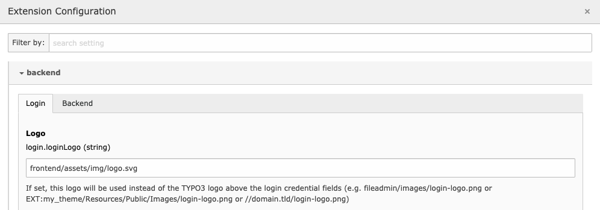

.. include:: ../../Includes.txt

.. _extension-options:

Configuration Options
=====================

In the :file:`ext_conf_template.txt` file configuration options
for an extension can be defined. They will be accessible in the TYPO3 backend
from Settings module.

There's a specific syntax to declare these options properly, which is
similar to the one used for TypoScript constants (see "Declaring
constants for the Constant editor" in
:ref:`Constants section in TypoScript Reference <t3tsref:typoscript-syntax-constant-editor>`.
This syntax applies to the comment line that should be placed just before the constant.
Consider the following example (taken from system extension "rsaauth"):

.. code-block:: typoscript

   # cat=basic/enable; type=string; label=Path to the temporary directory:This directory will contain...
   temporaryDirectory =

First a category (cat) is defined ("basic") with the subcategory
"enable". Then a type is given ("string") and finally a label, which
is itself split (on the colon ":") into a title and a description
(this should actually be a localized string). The
above example will be rendered like this in the EM:

The configuration tab displays all options from a single category. A
selector is available to switch between categories. Inside an option
screen, options are grouped by subcategory. At the bottom of the
screenshot, the label – split between header and description – is
visible. Then comes the field itself, in this case an input, because
the option's type is "string".

Available option types:

============= ==========================
Option type   Description
============= ==========================
boolean       checkbox
color         colorpicker
int           integer value
int+          positive integer value
integer       integer value
offset        offset
options       option select
small         small text field
string        text field
user          user function
wrap          wrap field
============= ==========================

Once you saved the configuration in the Extension Manager, it will be stored in
:php:`$GLOBALS['TYPO3_CONF_VARS']['EXTENSIONS']['your_extension_key']`
as an array.

To retrieve the configuration use the API provided by the :php:`\TYPO3\CMS\Core\Configuration\ExtensionConfiguration` class::

   $backendConfiguration = \TYPO3\CMS\Core\Utility\GeneralUtility::makeInstance(ExtensionConfiguration::class)
      ->get('your_extension_key');

This will return the whole configuration as an array.

To directly fetch specific values like :ts:`temporaryDirectory` from the example above::

   $backendConfiguration = \TYPO3\CMS\Core\Utility\GeneralUtility::makeInstance(ExtensionConfiguration::class)
      ->get('your_extension_key', 'temporaryDirectory');

You can also define nested options using the TypoScript notation:

.. code-block:: typoscript

   directories {
      # cat=basic/enable; type=string; label=Path to the temporary directory
      tmp =
      # cat=basic/enable; type=string; label=Path to the cache directory
      cache =
   }

This will result in a multidimensional array::

   $extensionConfiguration = $GLOBALS['TYPO3_CONF_VARS']['EXTENSIONS']['your_extension_key'];
   $extensionConfiguration['directories.']['tmp']
   $extensionConfiguration['directories.']['cache']

.. important::

   Notice the dot at the end of the :code:`directories` key.
   This notation must be used for every grouping key and
   is a convention of the TypoScript parser.
