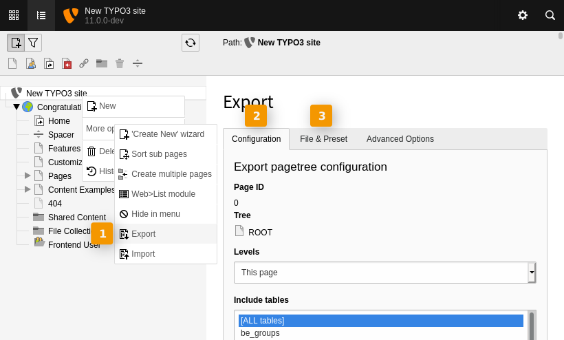

.. include:: /Includes.rst.txt
.. index:: ! Distributions
.. _distribution:

===========================
Creating a new distribution
===========================

This chapter describes the main steps in creating a new
distribution. It should not be considered as a full fledge
tutorial.

.. _distribution_concept:

Concept of distributions
========================

Distributions are full TYPO3 CMS websites ready to be unpacked. They provide
an easy quick start for using TYPO3 CMS. The most well known distribution is
"The official Introduction Package". Distributions can most easily be installed
in the backend Extension Manager in "Get preconfigured distribution", it lists
all available distributions for the given Core version.

A distribution is just an extension enriched with some further data that is
loaded or executed upon installing that extension. A distribution takes
care of the following parts:

- Deliver initial database data

- Deliver fileadmin files

- Deliver configuration for a package

- Hook into the process after saving configuration to
  trigger actions dependent on configuration values

- Deliver dependent extensions if needed (e.g., customized versions or
  extensions not available through TER)

.. _distribution-kickstart:

Kickstarting the Distribution
=============================

A distribution is a special kind of extension. The first step
is thus to create a new extension.
Start by registering an :ref:`extension key <extension-key>`,
which will be the unique identifier of your distribution.

Next create the :ref:`Extension declaration file <extension-declaration>` as usual,
except for the "category" property which must be set to
**distribution**.

.. _distribution-kickstart-image:

Configuring the Distribution Display in the EM
----------------------------------------------

You should provide two preview images for your distribution. Provide
a small 220x150 pixels for the list in the Extension Manager as
:file:`Resources/Public/Images/Distribution.png` and a larger 300x400 pixels
welcome image as :file:`Resources/Public/Images/DistributionWelcome.png`.
The welcome image is displayed in the distribution detail view inside the Extension Manager.

.. _distribution-kickstart-fileadmin:

Fileadmin Files
---------------

Create the following folder structure inside your extension:

- :file:`Initialisation`
- :file:`Initialisation/Files`

All the files inside that second folder will be copied to
:file:`fileadmin/<extkey>` during installation, where "extkey" is
the extension key of your distribution.

A good strategy on files (as followed by ext:introduction) is to construct
the distribution in a way that it can be unloaded after initial import
and removed from the file system.

To achieve that, when creating content for your distribution, all your
content related files (assets) should be located within :file:`fileadmin/<extkey>`
in the first place, and content elements or other records should reference
these files via FAL. A good export preset will then contain the content
related assets within your dump.

If there are files not directly referenced in tables selected for export
(for example ext:form .yml form configurations), you can locate them
within :file:`fileadmin/<extkey>`, too. Only those need to be copied to
:file:`Initialization/Files` - all other files referenced in database rows
will be within your export dump.

Note you should *not* end up with having all your site configuration
(TypoScript files, logos, css and so on) within :file:`fileadmin`. This
is considered bad practice. The main site setup should be an extension,
keep in mind that :file:`fileadmin` is for editors. In case of the
introduction distribution, the main site setup (templates, content elements, ...)
is included in the extension bootstrap_package, and ext:introduction has
a dependency to this. This way, ext:introduction only provides the
database dump and the asset files, while ext:bootstrap_package is the real
site setup. This ends up with only content related stuff being located in
:file:`fileadmin`, delivered by ext:introduction.

.. _distribution-kickstart-site:

Site configuration
------------------

In order to import a site configuration upon installation, supply a site config file
to :file:`Initialisation/Site/<SITE_IDENTIFIER>/config.yaml`.

.. note::

    Existing site configuration folders with the same identifier will neither be overwritten nor changed.
    See :doc:`t3core:Changelog/10.1/Feature-89010-IntroduceSiteConfigForDistributionPackages`

.. _distribution-kickstart-database:

Database Data
-------------

The database data is delivered as TYPO3 CMS export :file:`data.xml`.
Generate this file by exporting your whole installation
from the root of the page tree with the export module.

.. rst-class:: bignums-xxl

#. Page tree

   Open the export module by right-clicking on the root of the page tree and
   selecting :guilabel:`More Options > Export`.

#. Export module: Configuration

   Select the tables to be included in the export and click the
   :guilabel:`Update` button. Make sure that the table tx_impexp_presets is
   included, which contains the saved export configurations for repeated use
   (see next step). Fine-tune the export configuration by evaluating the
   list of records at the bottom of the page under "Inside pagetree":
   This is a pre-calculation of the records to be included in the export.

   Do not forget to click :guilabel:`Update` before proceeding to the next tab.

#. Export module: File & Preset

   To reuse your export configuration during the running
   distribution development, you should now save it as a preset. Find a
   descriptive title and click the :guilabel:`Save` button.

   Currently, after saving the export configuration, you jump to the first tab,
   so navigate back to the :guilabel:`File & Preset` tab.

   To finish the export, select the file format :guilabel:`XML` and click on
   the :guilabel:`Download export` button.

The file has to be named :file:`data.xml` (or :file:`data.t3d`, where the .t3d
format is harder to maintain). The dump file must be located in the
:file:`Initialisation` folder.

.. warning::

    Do *not* include backend users in the dump! If you do, you end up
    having your user on other systems who loaded your distribution. Give
    the export a special check in this area. Having your backend user
    in the dump is most likely a security vulnerability of your distribution
    if that distribution is uploaded to the public.

.. seealso::

   The introduction distribution comes with a maintained export preset within its
   `database export <https://github.com/FriendsOfTYPO3/introduction/blob/master/Initialisation/data.xml>`_
   that could be useful as kick start. Just import that preset into your
   installation and adapt to the needs of your distribution. The import works
   similar to the export.

   The export preset is configured as:

   * Export database data as :file:`data.xml`
   * Export only referenced FAL file relations into :file:`data.xml.files` directory,
     do not just export *all* files from fileadmin
   * Do not export be_users (!)
   * Do not export some other tables like sys_log and friends

It is also possible to have referenced files (images / media) in an own folder
called :file:`Initialisation/data.xml.files/` - a good export preset should
prepare that.

.. note::

    Due to Core bugs, importing extracted files from standalone file folder
    only works since Core version *8.7.10* and *9.1.0*. For older target
    Core versions, files must not be extracted (tab Advanced options), but
    directly included in :file:`data.xml`.

    Another Core issue prevents loading :file:`data.xml` if it is bigger than
    10MB. In this case the only option left is going with :file:`data.t3d`

.. _distribution-kickstart-configuration:

Distribution Configuration
--------------------------

A distribution is technically handled as an extension. Therefore you
can make use of all :ref:`configuration options <extension-options>` as needed.

After installing the extension, the event :ref:`AfterPackageActivationEvent<AfterPackageActivationEvent>` is
dispatched. You may use this to alter your website configuration (e.g. color
scheme) on the fly.

.. _distribution-testing:

Test Your Distribution
======================

To test your distribution, simply copy your extension to an empty
TYPO3 CMS installation and try to install it from the Extension
Manager.

To test a distribution locally without uploading to TER, just install
a blank TYPO3 (last step in installer "Just get me to the Backend"),
then go to Extension Manager, select "Get extensions" once to let the
Extension Manager initialize the extension list (this is needed if your
distribution has dependencies to other extensions, for instance ext:introduction
depends on ext:bootstrap_package). Next, copy or move the distribution extension
to :file:`typo3conf/ext`, it will then show up in Extension Manager default
tab "Installed Extensions".

Install the distribution extension from there. The Extension Manager will then resolve
TER dependencies, loads the database dump and will handle the file operations.
Under the hood, this does the same as later installing the distribution
via "Get preconfigured distribution", when it has been uploaded or updated in
TER, with the only difference that you can provide and test the distribution
locally *without* uploading to TER first.

.. warning::

   It is not enough to clean all files and the page tree if you want to
   try again to install your distribution. Indeed, TYPO3 CMS remembers that it
   previously imported your distribution and will skip any known files and
   the database import. Make sure to clean the table "sys_registry" if you want
   to work around that, or, even better, install a new blank TYPO3 to test again.
   Tip: Optimize creating the empty TYPO3 instance with a script, you probably
   end up testing the import a couple of times until you are satisfied with the result.

.. _distribution-more-information:

More Information
================

The `introduction extension <https://github.com/FriendsOfTYPO3/introduction>`_ is a
good starting point to see how distributions are handled in practice. It also comes
with an *impexp* preset to easily export database data with correct settings and
dependencies.

Some additional backgrounds can be retrieved from the
`blueprint for this feature <http://wiki.typo3.org/Blueprints/DistributionManagement>`_.
