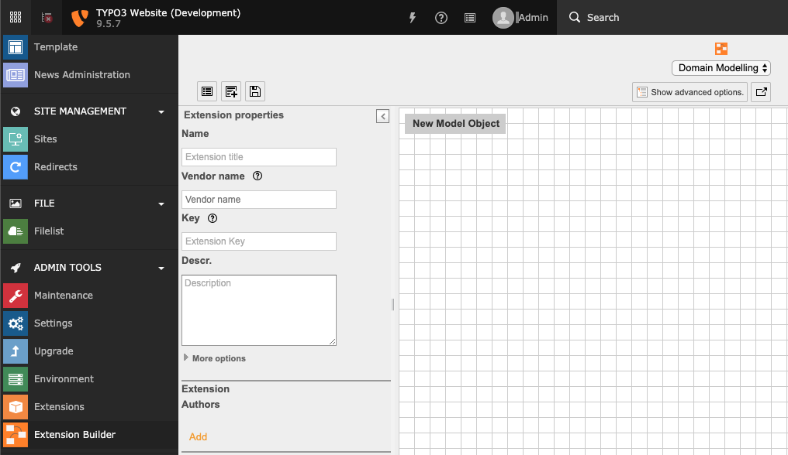

.. include:: /Includes.rst.txt

.. _extension-create-new:

========================
Creating a new extension
========================

This chapter is not a tutorial about how to create an Extension.
It only aims to be a list of steps to perform and key information
to remember.

First you have to :ref:`register an extension key <extension-key>`.
This is the unique identifier for your extension.

.. index::
   Extension development; Builder
   Extension development; Kickstarter
.. _extension-builder:

Kickstarting the extension
==========================

Although it is possible to write every single line of an extension from
scratch, there is a tool which makes it easier to start. It is called
"Extension builder" (key: "extension_builder") and can be installed from
TER.

.. hint::

   The extension builder in TER is usually not up to date. If you can't
   find a version supporting the latest TYPO3 version in TER, you can
   take a look into the
   `official github repository <https://github.com/FriendsOfTYPO3/extension_builder>`__.

The `Extension Builder <https://extensions.typo3.org/extension/extension_builder>`_
comes with its own BE module:

   The Domain Modeller screen of the Extension Builder. The comfort of building
   your model with drag and drop.

Note that this tool is not a complete editor. It helps you to create the scaffolding
of your extension and to generate all necessary PHP files. It is then up to you to complete these files
with your intended code.

.. warning::
   The Extension Builder has the feature to
   preserve code, but it should still be used with care.

After the extension has been written to the folder :file:`typo3conf/ext`, you will be able to activate
it locally and start using it.

Please refer to the `Extension Builder's manual <https://docs.typo3.org/typo3cms/extensions/extension_builder/>`__ for more information.
