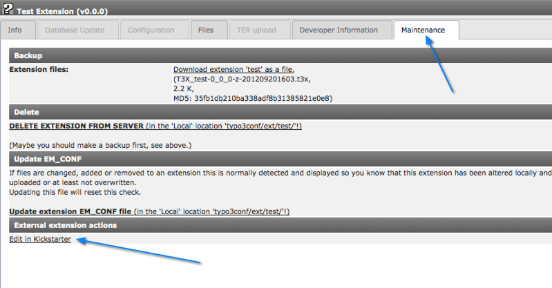

.. ==================================================
.. FOR YOUR INFORMATION
.. --------------------------------------------------
.. -*- coding: utf-8 -*- with BOM.

.. include:: ../../Includes.txt

.. _extension-create-new:

Creating a new extension
^^^^^^^^^^^^^^^^^^^^^^^^

This chapter is not a tutorial about how to create an Extension.
It only aims to be a list of steps to perform and key information
to remember.

.. _extension-key-registration:

Registering an extension key
""""""""""""""""""""""""""""

Before starting a new extension you should register an extension key
on typo3.org (unless you plan to make an implementation-specific
extension – of course – which it does not make sense to share).

Go to typo3.org, log in with your (pre-created) username / password
and go to Extensions > Extension Keys and click on the "Register keys"
tab. On that page you can enter the key name you want to register.

.. figure:: ../../Images/Typo3OrgRegistration.png
   :alt: The extension registration form

   The extension registration form on typo3.org.

See :ref:`t3api:extension-key`.

Kickstarting the extension
""""""""""""""""""""""""""

Although it is possible to write every single line of an extension from
scratch, the TYPO3 community provides tools that help prepare at least
the scaffolding. There are two such kickstarters:

- the "Extension kickstarter" (key: "kickstarter") helps create "old-style"
  extensions, like tradition BE module and "pi-based" FE plugins.
- the "Extension builder" (key: "extension_builder") helps create extensions
  based on Extbase, which is recommended.

Both can be installed from the TYPO3 Extension Repository (TER) like any
other extension.

The `Extension Kickstarter <http://typo3.org/extensions/repository/view/kickstarter>`_
installs as a sub-module of the Extension Manager
and looks like this:

.. figure:: ../../Images/ExtensionKickstarter.png
   :alt: A view from the Extension Kickstarter

   The "General info" screen, where you input the top-level information
   regarding your extension.

The `Extension Builder <http://typo3.org/extensions/repository/view/extension_builder>`_
comes with its own BE module:

.. figure:: ../../Images/ExtensionBuilder.png
   :alt: A view from the Extension Builder

   The Domain Modeller screen of the Extension Builder. The comfort of building
   your model with drag and drop.

Both these tools are not complete editors. They help you creating the scaffolding
of your extension, generate the necessary files. It's then up to you to fill these
with the relevant code. The Extension Builder goes further in that it also
creates model classes, skeleton code for the controllers, etc.

.. warning::
   Once you have started editing code inside your extension, you should not use
   the kickstarter anymore. The Extension Builder has some possibility to
   preserve code, but it should still be used with care.

After the extension is written to the server's disk you will be able to install
it locally and start using it.

.. _extension-more-kickstarter:

More about the Extension Kickstarter
""""""""""""""""""""""""""""""""""""

The Extension Builder comes with its own manual. This is not the case
of the Extension Kickstarter, for which some more information is
available here.

In the process of creating an extension it is rather typical to go
back to the Kickstarter a few times to fine tune the base code.
Experience suggests that this is especially useful to tuning the
configuration of database tables and fields.

The Kickstarter generates 2 files while it is working:
:code:`doc/wizard_form.dat` and :code:`doc/wizard_form.html` . As
long as these two files are present, the extension can be edited
again. Obviously you should remove those files once you are done with
the Kickstarter.

If you want to load the Kickstarter with the original configuration
used for your extension so you can add or edit features, just click
the extension title in the list of loaded/available extensions and
select "Edit in Kickstarter" from the menu (up to TYPO3 4.5):

.. figure:: ../../Images/ExtensionKickstarterEditUpTo45.png
   :alt: Editing an extension with the Kickstarter (up to TYPO3 4.5)

   Editing an extension again, in the Extension Manager up to TYPO3 4.5

Up to TYPO3 4.7, click on an extension and move to the "Maintenance" tab,
where the "Edit in Kickstarter" link is located:

   Editing an extension again, in the Extension Manager up to TYPO3 4.7

.. _extension-warning-editing:

Warning about re-editing
""""""""""""""""""""""""

As was mentioned already above re-editing is potentially dangerous
as it may give the impression
that the Kickstarter is an editor. So once more:  **the Kickstarter is
not an editor for your extensions** ! Whatever custom changes have
been made to the scripts of your new extension will be overwritten
when you write back the extension from the Kickstarter.

A good workflow for using the Kickstarter would be like this:

- Start by setting up all the features you need for your extension and
  write it with the Kickstarter.

- Begin to fill in dummy information in the database tables your
  extension contains. You will most likely find that you forgot
  something or misconfigured a database field. Since you have not yet
  done any changes to the files in the extension you can safely re-load
  the extension configuration (see above) and add the missing fields or
  whatever. Your dummy database content will not be affected by this
  operation.

- When you have tested that your database configuration works for your
  purpose you can begin to edit the PHP-scripts by hand (i.e.
  programming the extension itself). This is the "point-of-no-return"
  where you cannot safely return to the Kickstarter because you have now
  changed scripts manually.

