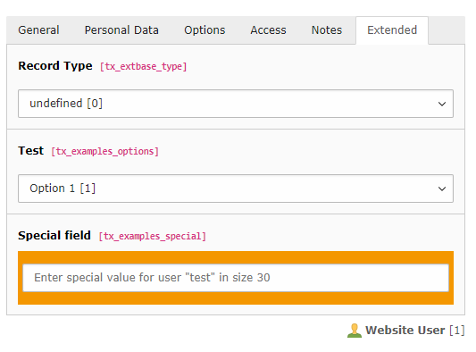

.. include:: ../../../Includes.txt

.. _extending-examples:

Customization examples
^^^^^^^^^^^^^^^^^^^^^^

Many extracts can be found throughout the manual, but this section
provides more complete examples.

.. _extending-examples-feusers:

Example 1: extending the fe\_users table
""""""""""""""""""""""""""""""""""""""""

The "examples" extension adds two fields to the "fe\_users" table.
Here's the complete code, taken from file
:file:`Configuration/TCA/Overrides/fe_users.php`:

.. code-block:: php

	<?php
	if (!defined('TYPO3_MODE')) {
		die ('Access denied.');
	}

	// Add some fields to FE Users table to show TCA fields definitions
	// USAGE: TCA Reference > $GLOBALS['TCA'] array reference > ['columns'][fieldname]['config'] / TYPE: "select"
	$temporaryColumns = array (
		'tx_examples_options' => array (
			'exclude' => 0,
			'label' => 'LLL:EXT:examples/Resources/Private/Language/locallang_db.xlf:fe_users.tx_examples_options',
			'config' => array (
				'type' => 'select',
				'items' => array (
					array('LLL:EXT:examples/Resources/Private/Language/locallang_db.xlf:fe_users.tx_examples_options.I.0', '1'),
					array('LLL:EXT:examples/Resources/Private/Language/locallang_db.xlf:fe_users.tx_examples_options.I.1', '2'),
					array('LLL:EXT:examples/Resources/Private/Language/locallang_db.xlf:fe_users.tx_examples_options.I.2', '--div--'),
					array('LLL:EXT:examples/Resources/Private/Language/locallang_db.xlf:fe_users.tx_examples_options.I.3', '3'),
				),
				'size' => 1,
				'maxitems' => 1,
			)
		),
		'tx_examples_special' => array (
			'exclude' => 0,
			'label' => 'LLL:EXT:examples/Resources/Private/Language/locallang_db.xlf:fe_users.tx_examples_special',
			'config' => array (
				'type' => 'user',
				'size' => '30',
				'userFunc' => 'Documentation\\Examples\\Userfuncs\\Tca->specialField',
				'parameters' => array(
					'color' => 'blue'
				)
			)
		),
	);

	\TYPO3\CMS\Core\Utility\ExtensionManagementUtility::addTCAcolumns(
		'fe_users',
		$temporaryColumns
	);
	\TYPO3\CMS\Core\Utility\ExtensionManagementUtility::addToAllTCAtypes(
		'fe_users',
		'tx_examples_options, tx_examples_special'
	);

First of all, the fields that we want to add are detailed according to
the :php:`$GLOBALS['TCA']` syntax for columns. This configuration is stored in the
:php:`$temporaryColumns` array.

After that come two additional steps:

- first the columns are actually added to the table by using
  :code:`\TYPO3\CMS\Core\Utility\ExtensionManagementUtility::addTCAcolumns()`.

- then the fields are added to the "types" definition of the
  "fe\_users" table by using :code:`\TYPO3\CMS\Core\Utility\ExtensionManagementUtility::addToAllTCAtypes()`.
  It is possible to be more fine-grained.

This does not create the corresponding fields in the database. The new
fields must also be defined in the :file:`ext_tables.sql` file of the
extension:

.. code-block:: mysql

	CREATE TABLE fe_users (
		tx_examples_options int(11) DEFAULT '0' NOT NULL,
		tx_examples_special varchar(255) DEFAULT '' NOT NULL
	);

.. warning::

   The above statement uses the SQL CREATE TABLE statement. This is the
   way TYPO3 expects it to be. The Extension Manager will automatically
   transform this into a ALTER TABLE statement when it detects that the
   table already exists.

By default new fields are added at the bottom of the form when editing
a record from that table. If the table uses tabs, new fields are added
at the bottom of the "Extended" tab (this tab is created if it does
not exist). The following screenshot shows the placement of the two
new fields when editing a "fe\_users" record:

   The new fields added at the bottom of the "Extended" tab

The next example shows how to place a field more precisely.

.. _extending-examples-ttcontent:

Example 2: extending the tt\_content table
""""""""""""""""""""""""""""""""""""""""""

In this second example, we will add a "No print" field to all content
element types. First of all, we add its SQL definition in
:file:`ext_tables.sql`:

.. code-block:: mysql

	CREATE TABLE tt_content (
		tx_examples_noprint tinyint(4) DEFAULT '0' NOT NULL
	);

Then we add it to the :php:`$GLOBALS['TCA']` in :file:`Configuration/TCA/Overrides/tt_content.php`:

.. code-block:: php

	$temporaryColumn = array(
		'tx_examples_noprint' => array (
			'exclude' => 0,
			'label' => 'LLL:EXT:examples/Resources/Private/Language/locallang_db.xlf:tt_content.tx_examples_noprint',
			'config' => array (
				'type' => 'check',
			)
		)
	);
	\TYPO3\CMS\Core\Utility\ExtensionManagementUtility::addTCAcolumns(
		'tt_content',
		$temporaryColumn
	);
	\TYPO3\CMS\Core\Utility\ExtensionManagementUtility::addFieldsToPalette(
		'tt_content',
		'visibility',
		'tx_examples_noprint',
		'after:linkToTop'
	);

The code is mostly the same as in the first example, but the last line
is very different and requires an explanation. The "pages" and "tt\_content"
use :ref:`palettes <palettes>` extensively for all fields
and not just for secondary options, for increased flexibility.
So in this case we use :code:`addFieldsToPalette()` instead of :code:`addToAllTCAtypes()`.
We need to specify the palette's key as the second argument (:code:`visibility`).
Precise placement of the new field is achieved with the fourth parameter
(:code:`after:linkToTop`). This will place the "no print" field right after the
"link to top" field, instead of putting it in the "Extended" tab.

The result is the following:

.. figure:: ../../../Images/ExtendingTcaTtContent.png
   :alt: New fields for tt\_content table

   The new field added next to an existing one

.. note::

   Obviously this new field will now magically exclude a content element
   from being printed. For it to have any effect, it must be used during
   the rendering by modifying the TypoScript used to render the
   "tt\_content" table. Although this is outside the scope of this
   manual, here is an example of what you could do, for the sake of
   showing a complete process.

   Assuming you are using "css\_styled\_content" (which is installed by
   default), you could add the following TypoScript to your template:

   .. code-block:: typoscript

      tt_content.stdWrap.outerWrap = 
|

      tt_content.stdWrap.outerWrap.if.isTrue.field = tx_examples_noprint

   This will wrap a "div" tag with a "noprint" class around any content
   element that has its "No print" checkbox checked. The final step would
   be to declare the appropriate selector in the print-media CSS file so
   that "noprint" elements don't get displayed.

   This is just an example of how the effect of the "No print" checkbox
   can be ultimately implemented. It is meant to show that just adding
   the field to the :php:`$GLOBALS['TCA']` is not enough.
