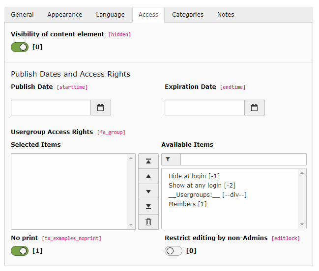

.. include:: /Includes.rst.txt
.. _extending-examples:

======================
Customization Examples
======================

Many extracts can be found throughout the manual, but this section
provides more complete examples.

.. index::
   TCA; fe_users
   File; EXT:{extkey}Configuration/TCA/Overrides/fe_users.php
.. _extending-examples-feusers:

Example 1: Extending the fe\_users table
========================================

The "examples" extension adds two fields to the "fe\_users" table.
Here's the complete code, taken from file
:file:`Configuration/TCA/Overrides/fe_users.php`:

.. code-block:: php

   <?php
   defined('TYPO3') or die();

   // Add some fields to fe_users table to show TCA fields definitions
   \TYPO3\CMS\Core\Utility\ExtensionManagementUtility::addTCAcolumns('fe_users',
      [
         'tx_examples_options' => [
            'exclude' => 0,
            'label' => 'LLL:EXT:examples/Resources/Private/Language/locallang_db.xlf:fe_users.tx_examples_options',
            'config' => [
               'type' => 'select',
               'renderType' => 'selectSingle',
               'items' => [
                  ['',0,],
                  ['LLL:EXT:examples/Resources/Private/Language/locallang_db.xlf:fe_users.tx_examples_options.I.0',1,],
                  ['LLL:EXT:examples/Resources/Private/Language/locallang_db.xlf:fe_users.tx_examples_options.I.1',2,],
                  ['LLL:EXT:examples/Resources/Private/Language/locallang_db.xlf:fe_users.tx_examples_options.I.2','--div--',],
                  ['LLL:EXT:examples/Resources/Private/Language/locallang_db.xlf:fe_users.tx_examples_options.I.3',3,],
               ],
               'size' => 1,
               'maxitems' => 1,
            ],
         ],
         'tx_examples_special' => [
            'exclude' => 0,
            'label' => 'LLL:EXT:examples/Resources/Private/Language/locallang_db.xlf:fe_users.tx_examples_special',
            'config' => [
               'type' => 'user',
               // renderType needs to be registered in ext_localconf.php
               'renderType' => 'specialField',
               'parameters' => [
                  'size' => '30',
                  'color' => '#F49700',
               ],
            ],
         ],
      ]
   );
   \TYPO3\CMS\Core\Utility\ExtensionManagementUtility::addToAllTCAtypes(
      'fe_users',
      'tx_examples_options, tx_examples_special'
   );

.. note::

   The second example :php:`tx_examples_special` only works when the
   :php:`renderType` has been registered implemented and then registered in
   the ext_localconf.php. Please refer to the the following chapter of the
   TCA reference on how to implement it: `t3tca:columns-user`.

In the first statement the fields are added by calling
:php:`ExtensionManagementUtility::addTCAcolumns()'. The first parameter is the
name of the table to which the fields should be added. The second parameter is
and array of the fields to be added. Each field is represented in the
:ref:`TCA syntax for columns <t3tca:columns>`.

In the second statement the fields are added to the "types" definition of the
"fe\_users" table by calling
:php:`ExtensionManagementUtility::addToAllTCAtypes()`. The first parameter is
the table name once more. The second parameter is a string, in the syntax as
used in the :ref:`showitem property of types in TCA
<t3tca:types-properties-showitem>`. An optional third
specify the position (:php:`'before'` or :php:`'after'`) in relation to an
existing field. So you could call optionally::

   \TYPO3\CMS\Core\Utility\ExtensionManagementUtility::addToAllTCAtypes(
      'fe_users',
      'tx_examples_options, tx_examples_special',
      '',
      'after:password'
   );

If the third parameter is omitted ot the specified field not found,
new fields are added at the bottom of the form. If the table uses tabs,
new fields are added at the bottom of the :guilabel:`Extended` tab. This tab
is created automatically if it
does not exist.

Neither statement creates the corresponding fields in the database. The new
fields must also be defined in the :file:`ext_tables.sql` file of the
extension:

.. code-block:: mysql

	CREATE TABLE fe_users (
		tx_examples_options int(11) DEFAULT '0' NOT NULL,
		tx_examples_special varchar(255) DEFAULT '' NOT NULL
	);

.. note::

   The above statement uses the SQL CREATE TABLE statement. This is the
   way TYPO3 expects it to be. The Extension Manager will automatically
   transform this into a ALTER TABLE statement when it detects that the
   table already exists.

The following screen shot shows the placement of the two
new fields when editing a "fe\_users" record:

   The new fields added at the bottom of the "Extended" tab

The next example shows how to place a field more precisely.

.. index::
   TCA; tt_content
   File; EXT:{extkey}Configuration/TCA/Overrides/tt_content.php
.. _extending-examples-ttcontent:

Example 2: Extending the tt\_content Table
==========================================

In the second example, we will add a "No print" field to all content
element types. First of all, we add its SQL definition in
:file:`ext_tables.sql`:

.. code-block:: mysql

	CREATE TABLE tt_content (
		tx_examples_noprint tinyint(4) DEFAULT '0' NOT NULL
	);

Then we add it to the :php:`$GLOBALS['TCA']` in :file:`Configuration/TCA/Overrides/tt_content.php`:

.. code-block:: php

   \TYPO3\CMS\Core\Utility\ExtensionManagementUtility::addTCAcolumns(
      'tt_content',
      [
         'tx_examples_noprint' => [
            'exclude' => 0,
            'label' => 'LLL:EXT:examples/Resources/Private/Language/locallang_db.xlf:tt_content.tx_examples_noprint',
            'config' => [
               'type' => 'check',
               'renderType' => 'checkboxToggle',
               'items' => [
                  [
                     0 => '',
                     1 => ''
                  ]
               ],
            ],
         ],
      ]
   );
	\TYPO3\CMS\Core\Utility\ExtensionManagementUtility::addFieldsToPalette(
      'tt_content',
      'access',
      'tx_examples_noprint',
      'before:editlock'
   );

The code is mostly the same as in the first example, but the last statement
is different and requires an explanation. The tables :code:`pages` and
:code:`tt\_content` use :ref:`palettes <palettes>` extensively. This increases
flexibility.

Therefore we call :code:`ExtensionManagementUtility::addFieldsToPalette()`
instead of :code:`ExtensionManagementUtility::addToAllTCAtypes()`.
We need to specify the palette's key as the second argument (:code:`access`).
Precise placement of the new field is achieved with the fourth parameter
(:code:`before:editlock`). This will place the "no print" field right before the
:guilabel:`Restrict editing by non-Admins` field, instead of putting it in the
:guilabel:`Extended` tab.

The result is the following:

   The new field added next to an existing one

.. note::

   Obviously this new field will now magically exclude a content element
   from being printed. For it to have any effect, it must be used during
   the rendering by modifying the TypoScript used to render the
   "tt\_content" table. Although this is outside the scope of this
   manual, here is an example of what you could do, for the sake of
   showing a complete process.

   Assuming you are using "fluid\_styled\_content" (which is installed by
   default), you could add the following TypoScript to your template:

   .. code-block:: typoscript

      tt_content.stdWrap.outerWrap = 
|

      tt_content.stdWrap.outerWrap.if.isTrue.field = tx_examples_noprint

   This will wrap a "div" tag with a "noprint" class around any content
   element that has its "No print" checkbox checked. The final step would
   be to declare the appropriate selector in the print-media CSS file so
   that "noprint" elements don't get displayed.

   This is just an example of how the effect of the "No print" checkbox
   can be ultimately implemented. It is meant to show that just adding
   the field to the :php:`$GLOBALS['TCA']` is not enough.
