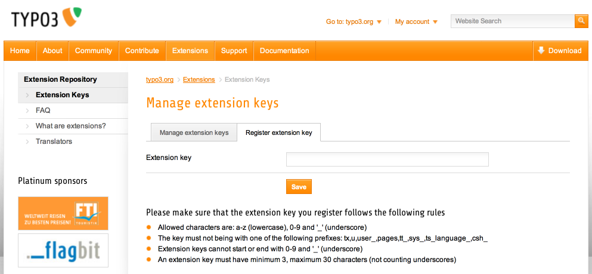

.. include:: ../../Includes.txt

.. _extension-key:

Choosing an extension key
^^^^^^^^^^^^^^^^^^^^^^^^^

The "extension key" is a string uniquely identifying the extension.
The folder where the extension resides is named by this string. The
string can contain characters a-z0-9 and underscore. No uppercase
characters should be used (keeps folder-,file- and table/field-names
in lowercase). Furthermore the name must not start with an "tx" or "u"
(this is prefixes used for modules) and because backend modules
related to the extension should be named by the extension name
*without* underscores, the extension name must still be unique even if
underscores are removed (underscores are allowed to make the extension
key easily readable).

The naming conventions of extension keys are automatically validated
by the registration at the repository, so you have nothing to worry
about here.

There are two ways to name an extension:

- **Project specific extensions** (not generally usable or shareable):
  Select any name you like and prepend it "user\_" (which is the only
  allowed use of a key starting with "u"). This prefix denotes that this
  extension is a local one which does not come from the central TYPO3
  Extension Repository or is ever intended to be shared. Probably this
  is an "adhoc" extension you have made for some special occasion.

- **General extensions:** Register an extension name online at the TYPO3
  Extension Repository. Your extension name will automatically be
  validated and you are sure to have a unique name returned which nobody
  else in the world uses. This makes it very easy to share your
  extension later on with every one else, because it ensures that no
  conflicts with other extension will happen. But by default a new
  extension you make is defined "private" which means nobody else but
  you have access to it until you permit it to be public. It's free of
  charge to register an extension name. By definition all code in the
  TYPO3 Extension Repository is covered by the GPL license because it
  interfaces with TYPO3. You should really consider making general
  extensions!

.. tip::
   It is far easier to settle for the right
   extension key from the beginning. Changing it later involves a cascade
   of name changes to tables, modules, configuration files etc. Think carefully.

.. _extension-license:

About GPL and extensions
""""""""""""""""""""""""

Remember that TYPO3 is GPL software and at the
same moment you extend TYPO3 your extensions are legally covered by
GPL. This does not  *force* you to share your extension, but it should
*inspire* you to do so and legally you cannot prevent anyone who gets
hold of your extension code from using it and further develop it.The
TYPO3 Extension API is designed to make sharing of your work easy as
well as using others work easy. Remember TYPO3 is Open Source Software
and we rely on each other in the community to develop it further.

.. important::
   It's also your responsibility to make sure that
   all content of your extensions is legally covered by GPL. The
   webmaster of TYPO3.org reserves the right to kick out any extension
   *without notice* that is reported to contain non-GPL material.

.. _extensions-security:

Security
""""""""

You are responsible for security issues in your
extensions. People may report security issues either directly to you
or to the TYPO3 Security Team. Whatever the case you should get in
touch with the Security Team which will validate the security fixes.
They will also include information about your (fixed) extension in
their next Security bulletin. If you don't respond to requests from
the Security Team, your extension will be forcibly removed from the
TYPO3 Extension Repository.

More details on the security team's policy on handling security issues
can be found at http://typo3.org/teams/security/extension-security-policy/.

.. _extension-key-registration:

Registering an extension key
""""""""""""""""""""""""""""

Before starting a new extension you should register an extension key
on typo3.org (unless you plan to make an implementation-specific
extension – of course – which it does not make sense to share).

Go to typo3.org, log in with your (pre-created) username / password
and go to Extensions > Extension Keys and click on the "Register keys"
tab. On that page you can enter the key name you want to register.

   The extension registration form on typo3.org.
