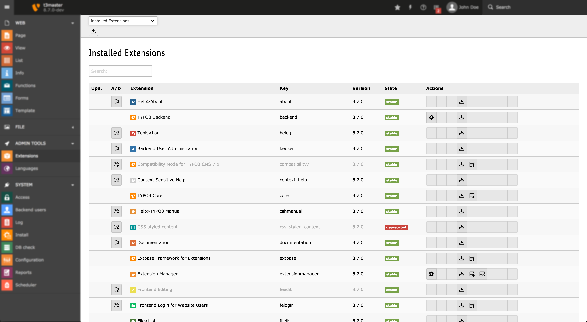

.. include:: /Includes.rst.txt

.. _extension-manager:

Extension Management
====================

Extensions are managed from the Extension Manager inside TYPO3 by
"admin" users. The module is located at **ADMIN TOOLS > Extensions**
and offers a menu with options to see loaded extensions (those that
are installed or activated), available extensions on the server and
the possibility to import extensions from online resources, typically
the TER (TYPO3 Extension Repository) located at typo3.org.

   Interface of the Extension Manager showing all available extensions.

The interface is really easy to use. You just click the +/- icon to
the left of an extension in order to install it and follow the
instructions.

.. _extension-install:

Installing extensions
^^^^^^^^^^^^^^^^^^^^^

There are only two (possibly three) steps involved in using extensions with TYPO3:

#. You must *import* it.

   This simply means to copy the extensions files into the correct directory into.
   More commonly you import an extension directly from the online TYPO3 Extension Repository (TER)
   using the Extension Manager. When an extension is found located in one of the extension locations,
   it is  *available* to the system.

   The Extension Manager (EM) should take care of this process, including updates to
   newer versions if needed.

   Another convenient way to install extensions is offered by using Composer (https://getcomposer.org/)
   along with the TYPO3 Composer Repository (https://composer.typo3.org/). The TYPO3 Composer Repository
   includes all TYPO3 extensions that are uploaded to TER.

#. You must *load* it.

   An extension is loaded only if it is listed in the :file:`PackageStates.php` file.
   Extensions are loaded in the order they appear in this list.

   An enabled extension is always global to the TYPO3 Installation - you cannot disable
   an extension from being loaded in a particular branch of the page tree. The EM takes
   care of enabling extensions. It's highly recommended that the EM is doing
   this, because the EM will make sure the priorities, dependencies and
   conflicts are managed according to the extension characteristics,
   including clearing of the cache-files if any.

#. You *might* be able to configure it.

   Certain extensions may allow you to configure some settings. **ADMIN TOOLS > Settings > Extension configuration**
   provides an interface to configure extensions that provide configuration settings. Any
   settings - if present - configured for an extension are available as
   an array in the variable :php:`$GLOBALS['TYPO3_CONF_VARS']['EXTENSIONS'][extensionKey]` and
   thus reside in :file:`typo3conf/LocalConfiguration.php`.

Loaded extensions can be fetched with :php:`TYPO3\CMS\Core\Package\PackageManager::getActivePackages()`,
available in both frontend and backend of TYPO3.

This will return an array of :php:`TYPO3\CMS\Core\Package\Package` objects,
containing the data structure for each extension. These include the properties:

.. t3-field-list-table::
 :header-rows: 1

 - :Key,20: Key
   :Description,60: Description

 - :Key:
         packageKey
   :Description:
         The package key (or extension key).

 - :Key:
         packagePath
   :Description:
         Path to the package. Can be used to determine, if the extension is
         local or global scope.

 - :Key:
         composerManifest
   :Description:
         A large array containing the composer manifest. (the
         :file:`composer.json` of the extension, if it exists)

 - :Key:
         packageMetaData
   :Description:
         Properties of the :file:`ext_emconf.php` configuration of the
         extension, like its constraints (depends, suggests, conflicts),
         version, title, description, …,

The order of the registered extensions in this array corresponds to
the order they were listed in :file:`PackageStates.php`.

.. _extension-package-manager:

Package Manager
^^^^^^^^^^^^^^^

On a low level, the list of loaded extensions is written to the file
:file:`typo3conf/PackageStates.php`. PHP class :code:`\TYPO3\CMS\Core\Package\PackageManager`
manages this file as part of the "Package management", it is part of the
core extension, but mostly used by the Extension Manager as the low level work horse.

The :file:`typo3conf/PackageStates.php` file contains a list of all active packages, example::

    <?php
    # PackageStates.php

    # This file is maintained by TYPO3's package management. Although you can edit it
    # manually, you should rather use the Extension Manager for maintaining packages.
    # This file will be regenerated automatically if it doesn't exist. Deleting this file
    # should, however, never become necessary if you use the package commands.

    return [
        'packages' => [
            'core' => [
                'packagePath' => 'typo3/sysext/core/',
            ],
            'extbase' => [
                'packagePath' => 'typo3/sysext/extbase/',
            ],
            'fluid' => [
                'packagePath' => 'typo3/sysext/fluid/',
            ],
            'install' => [
                'packagePath' => 'typo3/sysext/install/',
            ],
            'frontend' => [
                'packagePath' => 'typo3/sysext/frontend/',
            ],
            // ...
        ],
        'version' => 5,
    ];

.. warning::

   You should not edit this file manually, unless you know exactly what you are doing. It is
   rather easy to get this wrong, for instance the order of the list is important and should
   be handled with care.
