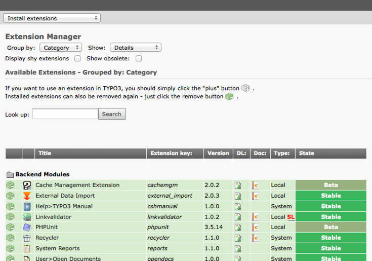
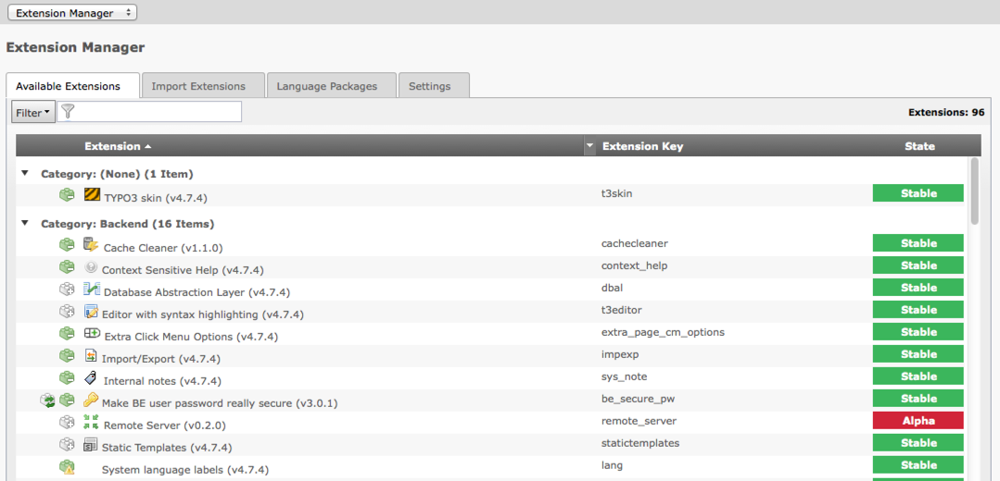

.. ==================================================
.. FOR YOUR INFORMATION
.. --------------------------------------------------
.. -*- coding: utf-8 -*- with BOM.

.. include:: ../../Includes.txt

.. _extension-manager:

The Extension Manager (EM)
^^^^^^^^^^^^^^^^^^^^^^^^^^

Extensions are managed from the Extension Manager inside TYPO3 by
"admin" users. The module is located at "Admin tools > Ext Manager"
and offers a menu with options to see loaded extensions (those that
are installed or activated), available extensions on the server and
the possibility to import extensions from online resources, typically
the TER (TYPO3 Extension Repository) located at typo3.org.

   Interface of the Extension Manager (up to TYPO3 4.5) showing the list
   of available extensions.

   Interface of the Extension Manager (from TYPO3 4.5 to TYPO3 4.7) showing
   all available extensions.

The interface is really easy to use. You just click the +/- icon to
the left of an extension in order to install it and follow the
instructions.

