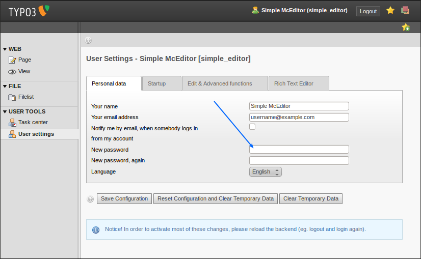
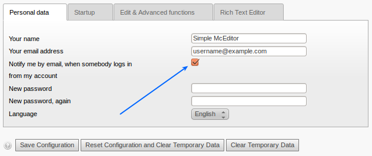

.. ==================================================
.. FOR YOUR INFORMATION
.. --------------------------------------------------
.. -*- coding: utf-8 -*- with BOM.

.. include:: ../../Includes.txt

Backend access
^^^^^^^^^^^^^^

Username
""""""""

Generic usernames such as "editor", "webmaster", "cms" or similar are
not recommended. Shared user accounts are not recommended either:
every person should have its own login (e.g. as first name + dot +
last name).

Password
""""""""

Please read the chapter about secure passwords. If your current TYPO3
password does not match the rules explained above, change your
password to a secure one as soon as possible. You should be able to
change your password in the "User settings" menu:

Administrator privileges
""""""""""""""""""""""""

If you are an editor for a TYPO3 website (and not a system
administrator or integrator), you should ensure that you do not have
administrator privileges. Some TYPO3 providers fear the effort to
create a proper editor account, because it involves quite a number of
additional configuration steps. If you, as an editor, should have an
account with administrator privileges, it is often an indication of a
misconfigured TYPO3 instance.

If you see a "Template" entry under the "WEB" menu or a section "ADMIN
TOOLS", you definitely have the wrong permissions as an editor and you
should get in touch with the system provider to solve this issue.

.. figure:: ../../Images/editor-admin-privileges-002b.png
   :alt: Screenshot of a menu with the section "ADMIN TOOLS"

Notify at login
"""""""""""""""

TYPO3 offers the feature to notify backend users by email, when
somebody logs in from your account. If you set this option in your
user settings, you will receive an email from TYPO3 each time you (or
"someone") logs in using your login details. Receiving such a
notification is an additional security measure because you will know
if someone else picked up your password and uses your account.

Assuming you have activated this feature and you got a notification
email but you have not logged in and you suspect that someone misuses
your credentials, get in touch with the person or company who hosts
and/or administrates the TYPO3 site immediately. You should discuss
the situation and the next steps, possibly to change the password as
soon as possible.

Lock to IP address(es)
""""""""""""""""""""""

Some TYPO3 instances are maintained by a selected group of editors who
only work from a specific IP range or (in an ideal world) from a
specific IP address only – an office network with a static public IP
address is a typical example.

In this case, it is recommended to lock down user accounts to
these/this address(es) only, which would block any login attempt from
someone coming from an unauthorized IP address.

Implementing this additional login limitation is the responsibility of
the person or company who hosts and/or administers the TYPO3 site.
Discuss the options with him/her and keep in mind that this is usually
a 10 minutes job for someone who knows TYPO3 (the configuration
directive "enabledBeUserIPLock" does exactly this, described in this
document, see chapter "Guidelines for TYPO3 Integrators: Global TYPO3
configuration options").

