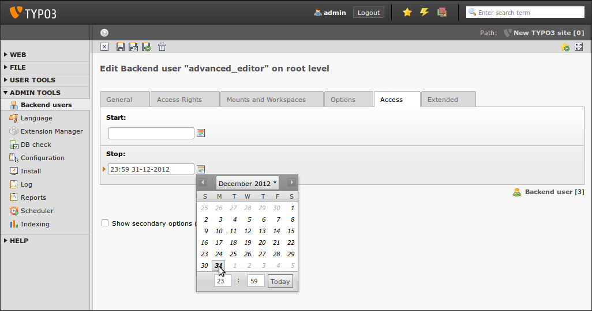

.. ==================================================
.. FOR YOUR INFORMATION
.. --------------------------------------------------
.. -*- coding: utf-8 -*- with BOM.

.. include:: ../../Includes.txt

.. _access-privileges:

Backend users and access privileges
^^^^^^^^^^^^^^^^^^^^^^^^^^^^^^^^^^^

TYPO3 CMS offers a very sophisticated and complex access concept: you can
define permissions on a user-level, on a group-level, on pages, on
functions, on DB mounts, even on content elements and more. This
concept is possibly a little bit complicated and maybe overwhelming if
you have to configure it for the first time in your integrator life,
but you will soon appreciate the options a lot.

As the first rule, you should grant backend users only a minimal set
of privileges, only to those functions they really need. This will not
only make the backend easier for them to use, but also makes the
system more secure. In most cases, an editor does not need to enter
any PHP, JavaScript or HTML code, so these options should be disabled.
You also should restrict access to pages, DB mounts, file mounts and
functions as much as possible. Note that limiting access to pages by
using DB mounts only is not the best way. In order to really deny
access, page permissions need to be set correctly.

It is always a good approach to set these permissions on a group level
(for example use a group such as "editors"), so you can simply create
a new user and assign this user to the appropriate group. It is not
necessary to update the access privileges for every user if you want
to adjust something in the future – simply update the group's
permissions instead.

When creating a new user, do not use generic usernames such as
"editor", "webmaster", "cms" or similar. You should use real names
instead (e.g. first name + dot + last name). Always remember the
guidelines for choosing a secure password when you set a password for
a new user or update a password for an existing user (set a good
example and inform the new user about your policies).

If backend users will leave the project at a known date, for example
students or temporary contractors, you should set an expiration date
when you create their accounts. Under certain circumstances, it
possibly makes sense to set this "stop" date for every user in
general, e.g. 6 months in the future. This forces the administrator
team to review the accounts from time to time and only extend the
users that are allowed to continue using the system.

