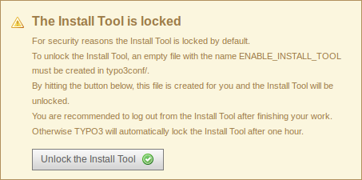
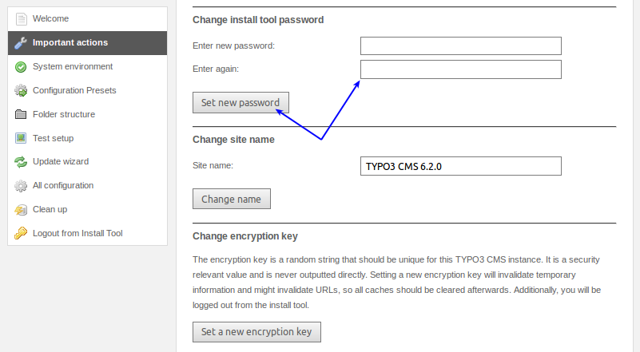
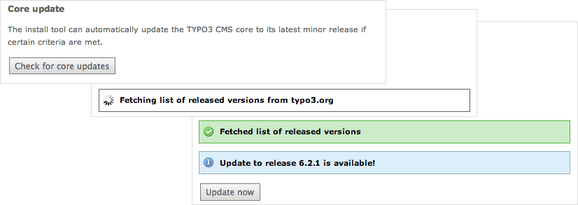

.. ==================================================
.. FOR YOUR INFORMATION
.. --------------------------------------------------
.. -*- coding: utf-8 -*- with BOM.

.. include:: ../../Includes.txt

.. _install-tool:

Install Tool
^^^^^^^^^^^^

The Install Tool allows you to configure the TYPO3 CMS system on a very
low level, which means, not only the basic settings but also the most
essential settings can be changed. You do not necessarily need a TYPO3 CMS
backend account to access the Install Tool, so it is clear that the
Install Tool requires some special attention (and protection).

TYPO3 CMS already comes with a two step mechanism out-of-the-box to
protect the Install Tool against unauthorized access: the first
measure is a file called "ENABLE\_INSTALL\_TOOL" which must exist if
the Install Tool should be accessible. The second mechanism is a
password protection, which is independent of all backend user
passwords.

The "ENABLE\_INSTALL\_TOOL" file can be created by putting an empty
file into the directory "typo3conf". You usually need write access to
this directory on a server level (for example via SSH, SFTP, etc.) or
you can create this file as a backend user with administrator
privileges. TYPO3 CMS versions prior 4.6.0 offer this function in the
"User Settings", and since TYPO3 CMS version 4.6.0 administrators can
unlock the Install Tool when accessing the module in the backend.

Conversely, this also means, you should delete this file as soon as
you do not need to access the Install Tool any more. It should also be
mentioned that TYPO3 deletes the "ENABLE\_INSTALL\_TOOL" file
automatically if you logout of the Install Tool or if the file is
older than 60 minutes (expiry time). Both features can be deactivated
if the content of this file is "KEEP\_FILE", which is understandably
not recommended.

The password for accessing the Install Tool is stored as a salted MD5
hash in the global configuration file "typo3conf/LocalConfiguration.php"::

   'BE' => 'installToolPassword' = '$P$CnawBtpk.D22VwoB2RsN0jCocLuQFp.'

In TYPO3 versions before 6.2, this value is a standard (unsalted) MD5
hash::

   'BE' => 'installToolPassword' = 'bacb98acf97e0b6112b1d1b650b84971'

During an update from TYPO3 version 6.0 or 6.1 to 6.2, the standard
MD5 hash is automatically converted into a salted hash.

In TYPO3 versions prior 6.0, the MD5 hash of the Install Tool password
is stored in the file "typo3conf/localconf.php"::

   $TYPO3_CONF_VARS['BE']['installToolPassword'] = "bacb98acf97e0b6112b1d1b650b84971";

Since TYPO3 version 6.2, the Install Tool password is set during the
installation process. This means, in the case that a system administrator
hands over the TYPO3 instance to you, he/she should also provide you
with the appropriate password.

In older versions of TYPO3, the default password "joh316" is used as the
Install Tool password. The first thing you should do, after taking over
a new TYPO3 system from a system administrator, is to change the password
to a new and secure one. Log-in to the Install Tool and change it there.

The option to change the password of the Install Tool in TYPO3 versions
before 6.2 is located under the menu item "About".

For additional security, the folder "typo3/install" can be renamed,
deleted, or password protected on a server level (e.g. by a web
server's user authentication mechanism). Please keep in mind that
these measures have an impact on the usability of the system. If you
are not the only person who uses the Install Tool, you should
definitely discuss your intention with the team.

TYPO3 core updates
""""""""""""""""""

Since TYPO3 CMS 6.2, the Install Tool allows integrators to update the
core of TYPO3 with a click of a button. This feature can be found under
"Important actions" and it checks/installs revision updates only (e.g.
bug fixes and security updates).

It should be noted that this feature can be disabled by the environment
variable::

   TYPO3_DISABLE_CORE_UPDATER=1

