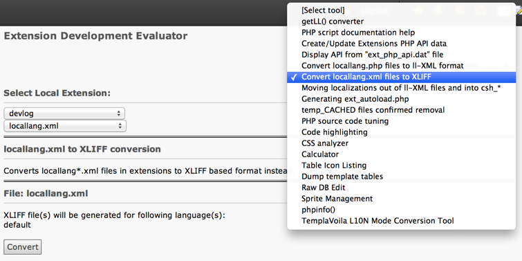

.. ==================================================
.. FOR YOUR INFORMATION
.. --------------------------------------------------
.. -*- coding: utf-8 -*- with BOM.

.. include:: ../../Includes.txt

.. _xliff-migration:

Migration to XLIFF and compatibility issues
-------------------------------------------

Migrating the "locallang" files from one's own extension from the
proprietary XML format to XLIFF is very easy. Extension
"`extdeveval <http://git.typo3.org/TYPO3v4/Extensions/extdeveval.git>`_"
provides a tool for changing the file format.

   The locallang conversion utility in extdeveval

.. _xliff-compatibility:

Compatibility with TYPO3 CMS 4.5
^^^^^^^^^^^^^^^^^^^^^^^^^^^^^^^^

XLIFF files are not supported by TYPO3 CMS 4.5 or older versions.
If you still want to migrate your files to XLIFF and stay compatible
with older TYPO3 versions, you can make your extensions depend on
extension "`xliff <http://typo3.org/extensions/repository/view/xliff/current/>`_".
This extension takes care of creating the locallang-XML files out of
the XLIFF versions.

.. tip::

   When referring to a localized file, the file extension does not matter.
   This means that both :code:`LLL:EXT:foo/locallang.xml:bar` and
   :code:`LLL:EXT:foo/locallang.xlf:bar` can be used interchangeably.
