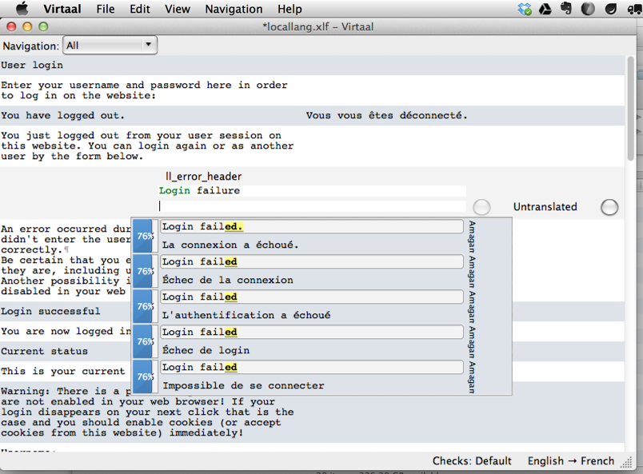
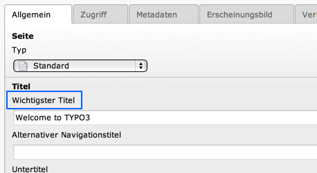
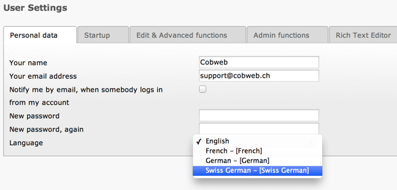

.. include:: ../../Includes.txt

.. _xliff-translating:

Translating XLIFF files
-----------------------

This sections highlights the different ways to translate XLIFF files.

.. _xliff-translating-server:

The TYPO3 translation server
^^^^^^^^^^^^^^^^^^^^^^^^^^^^

The TYPO3 community manages an official translation server, running
`Pootle <http://pootle.translatehouse.org>`__. Localization files
in English are uploaded on that server and translations are packaged nightly.
They are fecthed in the TYPO3 CMS backend, via the Extension Manager (or the
new "Language" module since version 6.0).

It is not the point of this manual to go into the details of the translation
process. More information can be found in the `TYPO3 wiki <http://wiki.typo3.org/Translation>`_.

.. _xliff-translating-local:

Translating locally
^^^^^^^^^^^^^^^^^^^

Using `Virtaal <http://translate.sourceforge.net/wiki/virtaal/index>`_,
it is possible to translate XLIFF files locally.
Virtaal is an open source, cross-platform application.

   Translating with Virtaal, with suggestions from other software

Translating files locally is useful for extensions which are not meant to be
published or for creating :ref:`custom translations <xliff-translating-custom>`.

.. _xliff-translating-custom:

Custom translations
^^^^^^^^^^^^^^^^^^^

The :php:`$GLOBALS['TYPO3_CONF_VARS']['SYS']['locallangXMLOverride']` allows to
override both locallang-XML and XLIFF files. Actually this is not just about translations.
Default language files can also be overridden. In the case of XLIFF files, the
syntax is as follows (to be placed in an extension's :file:`ext_localconf.php` file):

.. code-block:: php

   $GLOBALS['TYPO3_CONF_VARS']['SYS']['locallangXMLOverride']['EXT:cms/locallang_tca.xlf'][] = 'EXT:examples/Resources/Private/Language/custom.xlf';
   $GLOBALS['TYPO3_CONF_VARS']['SYS']['locallangXMLOverride']['de']['EXT:news/Resources/Private/Language/locallang_modadministration.xlf'][] = 'EXT:examples/Resources/Private/Language/Overrides/de.locallang_modadministration.xlf';

The first line shows how to override a file in the default language,
the second how to override a German ("de") translation. The German language file
looks like this:

.. code-block:: xml

   <?xml version="1.0" encoding="utf-8" standalone="yes" ?>
   <xliff version="1.0">
      <file source-language="en" datatype="plaintext" original="messages" date="2013-03-09T18:44:59Z" product-name="examples">
         <header/>
         <body>
            <trans-unit id="pages.title_formlabel" xml:space="preserve">
               <source>Most important tile</source>
               <target>Wichtigster Titel</target>
            </trans-unit>
         </body>
      </file>
   </xliff>

and the result can be easily seen in the backend:

   Custom translation in the TYPO3 backend

.. important::

   - Please note that you do not have to copy the full reference file, but only the labels you want to translate.

   - The path to the file to override must be expressed as:file:`EXT:foo/bar/...`. For the
     extension "xlf" or "xml" can be used interchangeably. The TYPO3 Core will try both anyway,
     but using "xlf" is more correct and future-proof.

.. attention::

   The following is a **bug** but must be taken as a constraint for now:

   - The files containing the custom labels must be located inside an extension. Other locations
     will not be considered.

   - The original translation needs to exist in:file:`typo3temp/l10n/` or next to the base
     translation file in extensions, for example in:file:`typo3conf/ext/myext/Resources/Private/Language/`.

.. _xliff-translating-languages:

Custom languages
^^^^^^^^^^^^^^^^

Going further it is even possible - since TYPO3 CMS 4.6 - to add custom
languages to the TYPO3 backend and create the translations locally using
XLIFF files.

First of all, the language must be declared::

   $GLOBALS['TYPO3_CONF_VARS']['SYS']['localization']['locales']['user'] = array(
       'gsw_CH' => 'Swiss German',
   );

.. important::

   - Locales are loaded during the bootstrap of TYPO3, before reading the
     extensions' configuration. Therefore you need to declare the custom
     languages in :file:`AdditionalConfiguration.php` and not in extensions.

This new language does not need to be entirely translated. It can be defined
as falling back to another language, so that only differing labels need be
translated::

  $GLOBALS['TYPO3_CONF_VARS']['SYS']['localization']['locales']['dependencies'] = array(
     'gsw_CH' => array('de_AT', 'de'),
  );

In this case we define that "gsw_CH" (which is the `official code <http://www.localeplanet.com/icu/>`_ for
"Schwiizertüütsch" - that is, "Swiss German") can fall back on "de_AT" (another custom translation) and then on "de".

The translations have to be stored in the appopriate folder, in this case
:file:`typo3conf/l10n/gsw_CH`.

The very least you need is to translate the label containing the name of the
language itself, so that it appears in the user preferences. In our example
this would be in file :file:`typo3conf/l10n/gsw_CH/setup/mod/gsw_CH.locallang.xlf`.

.. code-block:: xml

   <?xml version='1.0' encoding='utf-8'?>
   <xliff version="1.0">
      <file source-language="en" target-language="gsw_CH" datatype="plaintext" original="messages" product-name="setup">
         <header/>
         <body>
            <trans-unit id="lang_gsw_CH" approved="yes">
               <source>Swiss German</source>
               <target state="translated">Schwiizertüütsch</target>
            </trans-unit>
         </body>
      </file>
   </xliff>

   The new language appears in the user preferences

.. note::

   Any language will always fall back on the default one (i.e. English) when
   a translation is not found. A custom language will fall back on its "parent"
   language automatically. Thus - in our second example of de_AT (German for Austria) - no fallback would have to be
   defined for "de_AT" if it were just falling back on "de".

.. _xliff-translating-servers:

Custom translation servers
^^^^^^^^^^^^^^^^^^^^^^^^^^

With the use of XLIFF and the freely available `Pootle <http://pootle.translatehouse.org/>`__
translation server, companies and individuals may easily set up a custom translation server
for their extensions.

There is a signal that can be caught to change the translation server URL to use. The first
step is to register one's code for handling the signal. Such code would be placed in an
extension's :file:`ext_localconf.php` file:

.. code-block:: php

   $signalSlotDispatcher = \TYPO3\CMS\Core\Utility\GeneralUtility::makeInstance('TYPO3\\CMS\\Extbase\\SignalSlot\\Dispatcher');

   $signalSlotDispatcher->connect(
      version_compare(TYPO3_version, '7.0', '<')
         ? 'TYPO3\\CMS\\Lang\\Service\\UpdateTranslationService'
         : 'TYPO3\\CMS\\Lang\\Service\\TranslationService',
      'postProcessMirrorUrl',
      'Company\\Extension\Slots\\CustomMirror',
      'postProcessMirrorUrl'
   );

The class (slot) which receives the signal (:file:`EXT:myext/Classes/Slots/CustomMirror.php`)
could look something like:

.. code-block:: php

   <?php
   namespace Company\Extensions\Slots;
   class CustomMirror {

      /** @var string */
      static protected $extKey = 'myext';

      public function postProcessMirrorUrl($extensionKey, &$mirrorUrl) {
         if ($extensionKey === self::$extKey) {
            $mirrorUrl = 'http://mycompany.tld/typo3-packages/';
         }
      }
   }

Note that the mirror URL is passed as a reference, so that it can be
modified. In the above example, the URL is changed only for a given
extension, but of course it could be changed on a more general basis.

On the custom translation server side, the structure needs to be:

.. code-block:: text

   https://mycompany.tld/typo3-packages/
   `-- <first-letter-of-extension-key>
      `-- <second-letter-of-extension-key>
         `-- <extension-key>-l10n
            |-- <extension-key>-l10n-de.zip
            |-- <extension-key>-l10n-fr.zip
            |-- <extension-key>-l10n-it.zip
            `-- <extension-key>-l10n.xml

hence in our example:

.. code-block:: text

   https://mycompany.tld/typo3-packages/
   `-- m
      `-- y
         `-- myext-l10n
            |-- myext-l10n-de.zip
            |-- myext-l10n-fr.zip
            |-- myext-l10n-it.zip
            `-- myext-l10n.xml

And the :file:`myext-l10n.xml` file contains something like:

.. code-block:: xml

   <?xml version="1.0" standalone="yes" ?>
   <TERlanguagePackIndex>
      <meta>
         <timestamp>1374841386</timestamp>
         <date>2013-07-26 14:23:06</date>
      </meta>
      <languagePackIndex>
         <languagepack language="de">
            <md5>1cc7046c3b624ba1fb1ef565343b84a1</md5>
         </languagepack>
         <languagepack language="fr">
            <md5>f00f73ae5c43cb68392e6c508b65de7a</md5>
         </languagepack>
         <languagepack language="it">
            <md5>cd59530ce1ee0a38e6309544be6bcb3d</md5>
         </languagepack>
      </languagePackIndex>
   </TERlanguagePackIndex>
