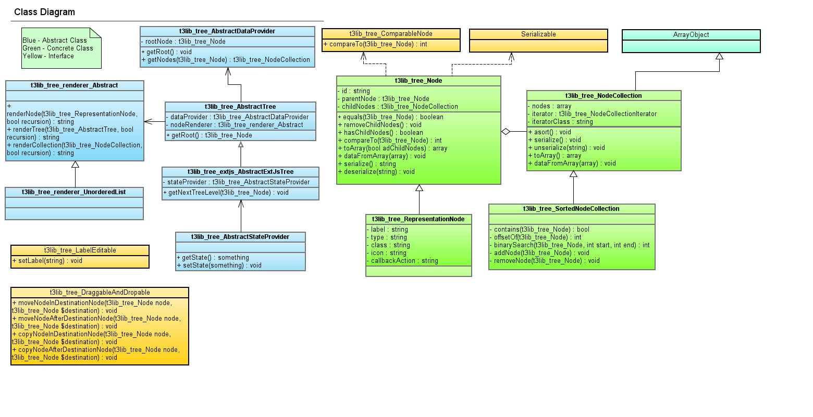
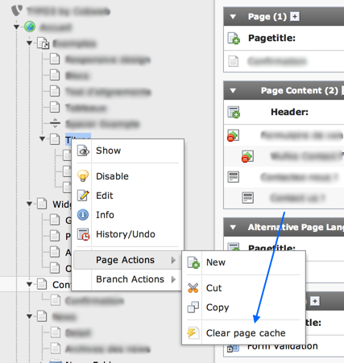
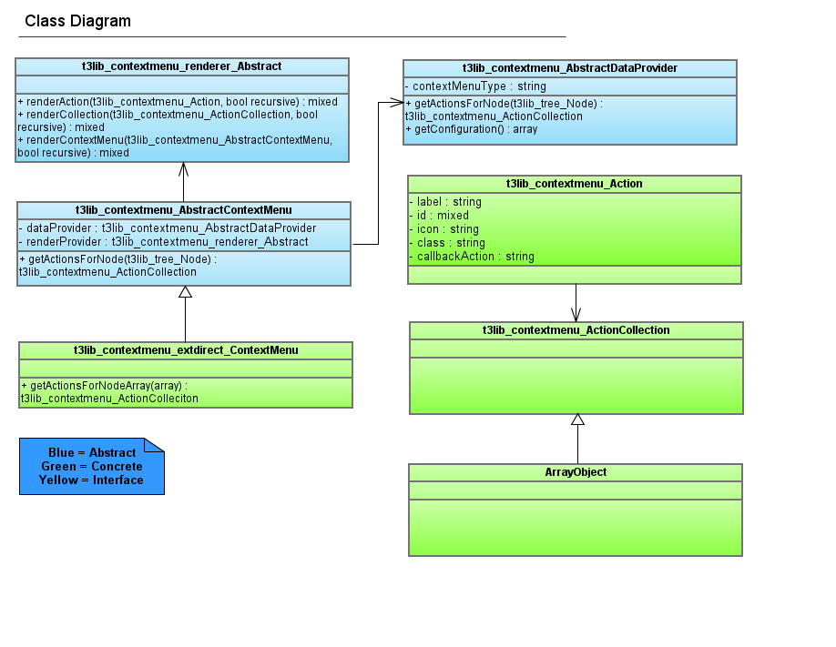

.. ==================================================
.. FOR YOUR INFORMATION
.. --------------------------------------------------
.. -*- coding: utf-8 -*- with BOM.

.. include:: ../../../Includes.txt

.. _pagetree:

Page tree
^^^^^^^^^

Since TYPO3 4.5, the page tree is powered by ExtJS. It is implemented in the
global viewport as a :ref:`navigation component <viewport-navigation>`.

   A UML diagram of the related TYPO3 classes

.. note::
   Unfortunately the components were never cleaned up nor generalized,
   so it's not possible to reuse them in different contexts. However
   it does provide a clean API for context-sensitive menu items.

The options available to configure the page tree are described in the
:ref:`TSconfig reference<t3tsconfig:start>`.

Additionally a limit can be set to the number of pages preloaded by the tree.
Loading more pages will make it more responsive, but also increases the number
of queries executed. The setting is::

   $GLOBALS['TYPO3_CONF_VARS']['BE']['pageTree']['preloadLimit']

.. _context-menu:

Context-sensitive menus
^^^^^^^^^^^^^^^^^^^^^^^

With the new page tree the implementation of the context-sensitive menu (CSM) items
was made more flexible and easier to configure.

.. warning::

   The section below applies only to the CSM for the page tree. Other CSM still
   use the :ref:`old way of doing things <csm>`.

.. _context-menu-configuration:

Configuration
"""""""""""""

The CSM is entirely described in User TSconfig.
The configuration is found in :file:`t3lib/stddb/DefaultConfiguration.php`.
Here is a sample:

.. code-block:: typoscript

 options.contextMenu {
 	table {
 		pages_root {
 			disableItems =

 			items {
 				100 = ITEM
 				100 {
 					name = view
 					label = LLL:EXT:lang/locallang_core.xml:cm.view
 					spriteIcon = actions-document-view
 					displayCondition = canBeViewed != 0
 					callbackAction = viewPage
 				}
 				...
 			}
 		}

 		pages {
 			disableItems =

 			items {
 				...

 				700 = ITEM
 				700 {
 					name = history
 					label = LLL:EXT:lang/locallang_misc.xml:CM_history
 					spriteIcon = actions-document-history-open
 					displayCondition = canShowHistory != 0
 					callbackAction = openHistoryPopUp
 				}

 				800 = DIVIDER

 				900 = SUBMENU
 				900 {
 					label = LLL:EXT:lang/locallang_core.xml:cm.copyPasteActions

 					100 = ITEM
 					100 {
 						name = new
 						label = LLL:EXT:lang/locallang_core.xml:cm.new
 						spriteIcon = actions-page-new
 						displayCondition = canCreateNewPages != 0
 						callbackAction = newPageWizard
 					}
 					...
 				}
 				...
 			}
 		}
 	}
 }

As one can see the page tree is organized in tables (that's really just "pages" for now),
with a special case for the tree root. Then comes a list of items, which are either ITEM
or SUBMENU components. The latter are comprised of more ITEM components. A DIVIDER component
can also be used to introduce a visual separator.

The numbered keys determine the order
the items appear in. The default configuration uses multiples of hundred, so that there
is plenty of room to introduce custom items in between the default ones
(e.g. item 751 will appear between items 700 and 800).

.. _context-menu-custom:

Adding custom actions
"""""""""""""""""""""

Delivering custom menu items via an extension is a several step process.
The code samples presented below come from extension
`sm_clearcachecm <http://typo3.org/extensions/repository/view/sm_clearcachecm>`_
by Steffen Müller. Thanks to him for allowing these samples to be shared.
The extension adds an item in the "Page actions" and the "Branc actions" submenus
to clear the cache of the page, respectively the branch.

   The contextual menu with the "Clear page cache" item added to it.

.. _context-menu-custom-configuration:

Extending the configuration
~~~~~~~~~~~~~~~~~~~~~~~~~~~

The first step is to add the necessary User TSconfig in the extension's
:file:`ext_tables.php` file, to declare and position the custom item
in the existing menu::

   $GLOBALS['TYPO3_CONF_VARS']['BE']['defaultUserTSconfig'] .= '
   	options.contextMenu.table.pages.items {
   		900 {
   			1010 = DIVIDER
      			1020 = ITEM
   			1020 {
   				name = clearPageCache
   				label = LLL:EXT:sm_clearcachecm/Ressources/Private/Language/locallang_cm:clearPageCache
   				spriteIcon = actions-system-cache-clear
   				callbackAction = clearPageCache
   			}
   		}
   		1000 {
   			410 = DIVIDER
      			420 = ITEM
   			420 {
   				name = clearBranchCache
   				label = LLL:EXT:sm_clearcachecm/Ressources/Private/Language/locallang_cm:clearBranchCache
   				spriteIcon = actions-system-cache-clear-impact-medium
   				callbackAction = clearBranchCache
   			}
   		}
   	}
   ';

Here are the various parameters that must or should be used when
declaring menu items:

.. t3-field-list-table::
 :header-rows: 1

 - :Property,30: Name
   :Description,70: Description

 - :Property:
         name
   :Description:
         Name of the action (can be used to disable it).

 - :Property:
         label
   :Description:
         Language label of the action.

 - :Property:
         icon
   :Description:
         Image that should be shown to the left of the action item.

 - :Property:
         spriteIcon
   :Description:
         Key of the sprite icon to use instead of some arbitrary image
         (see "icon" above).

 - :Property:
         displayCondition
   :Description:
         Condition that is parsed and interpreted to decide whether
         the action item should be shown or not for a given tree node.

         The syntax is similar to PHP conditions, with the usual comparison operators
         and the logical operators && and || to chain conditions. The values that can be
         used for comparison are the return values provided by the methods in the API
         of class :code:`\TYPO3\CMS\Backend\Tree\Pagetree\PagetreeNode`. If that return value is an array,
         any index can be accessed using the | operator::

            displayCondition = getRecord|hidden = 1 && canBeDisabledAndEnabled != 0

         In the above example the condition calls the :code:`getRecord()` method
         which returns the complete record array of the page the node corresponds to.
         The index "hidden" of this array is checked to see if it's true. Afterwards
         it is chained with an && ("AND") operator to the next condition,
         which checks whether a node can be disabled and enabled, returning boolean value.
         If both conditions evaluate to true, the context action is displayed.

         For more examples look up the default configuration found in
         :file:`t3lib/stddb/DefaultConfiguration.php`.

 - :Property:
         callbackAction
   :Description:
         Javascript callback action that should be triggered after
         the action item is clicked.

 - :Property:
         customAttributes
   :Description:
         TypoScript array of custom attributes that can be used for your actions.

.. _context-menu-custom-action:

JavaScript action
~~~~~~~~~~~~~~~~~

The next step is to add the JavaScript actions triggered by a click to the
actions of the page tree component. This script must be loaded as an
"additional backend item", using the dedicated API (in file
:file:`ext_tables.php`::

   $GLOBALS['TYPO3_CONF_VARS']['typo3/backend.php']['additionalBackendItems'][] = \TYPO3\CMS\Core\Utility\ExtensionManagementUtility::extPath($_EXTKEY, 'Ressources/Private/Php/RegisterJavaScriptForPagetreeAction.php');

This file contains the following code:

.. code-block:: javascript

   Ext.onReady(function() {
   	Ext.apply(TYPO3.Components.PageTree.Actions, {
   		clearPageCache: function(node, tree) {
   			TYPO3.SmClearcachecm.ClickmenuAction.clearPageCache(
   				node.attributes.nodeData,
   				function(response) {
   					if (response) {
   						TYPO3.Flashmessage.display(TYPO3.Severity.error, '', response);
   					} else {
   						TYPO3.Flashmessage.display(TYPO3.Severity.ok, '', TYPO3.lang.sm_clearcachecm_clearPageCacheSuccess);
   					}
   				},
   				this
   			);
   		}
   	});
   	Ext.apply(TYPO3.Components.PageTree.Actions, {
   		clearBranchCache: function(node, tree) {
   			TYPO3.SmClearcachecm.ClickmenuAction.clearBranchCache(
   				node.attributes.nodeData,
   				function(response) {
   					if (response) {
   						TYPO3.Flashmessage.display(TYPO3.Severity.error, '', response);
   					} else {
   						TYPO3.Flashmessage.display(TYPO3.Severity.ok, '', TYPO3.lang.sm_clearcachecm_clearBranchCacheSuccess);
   					}
   				},
   				this
   			);
   		}
   	});
   });

The above code adds :ref:`extdirect` callbacks to the new menu items.

.. _context-menu-custom-extdirect:

Ext.Direct stuff
~~~~~~~~~~~~~~~~

The last step is to write the PHP code that will answer to the Ext.Direct calls.
First the PHP class must be registered as usual::

   \TYPO3\CMS\Core\Utility\ExtensionManagementUtility::registerExtDirectComponent(
   	'TYPO3.SmClearcachecm.ClickmenuAction',
   	\TYPO3\CMS\Core\Utility\ExtensionManagementUtility::extPath($_EXTKEY) . 'Classes/Hooks/ClickmenuAction.php:Tx_SmClearcachecm_Hooks_ClickmenuAction'
   );

The PHP class itself contains the methods corresponding to the Ext.Direct JavaScript methods,
in this case :code:`clearPageCache` and :code:`clearBranchCache`. They receive information about
which node was clicked. This information can be made into a node object, as demonstrated below::

   public function clearPageCache($nodeData) {
      	$nodeUids = array();
      		/* @var $node \TYPO3\CMS\Backend\Tree\Pagetree\PagetreeNode */
   	$node = \TYPO3\CMS\Core\Utility\GeneralUtility::makeInstance('TYPO3\\CMS\\Backend\\Tree\\Pagetree\\PagetreeNode', (array) $nodeData);
      		// Get uid of page
   	$nodeUids[] = $node->getId();
      		// Clear the page cache of the page
   	$success = $this->performClearCache($nodeUids);
      	if (!$success) {
   		return $GLOBALS['LANG']->sL('LLL:EXT:sm_clearcachecm/Ressources/Private/Language/locallang_cm.xml:clearPageCacheError', TRUE);
   	}
   }

.. _context-menu-custom-callbacks:

Predefined callbacks
~~~~~~~~~~~~~~~~~~~~

The TYPO3 Core provides one predefined callback which can be used to open a defined URL
inside the content frame. It's called :code:`openCustomUrlInContentFrame` and needs
a defined custom attribute named "contentUrl". The keyword :code:`###ID###` is automatically
replaced with the selected page id. Example:

.. code-block:: typoscript

   720 = ITEM
   720 {
   	name = someCustomeAction
   	label = LLL:EXT:extension/locallang.xml:someCustomeAction
   	icon = ' . \TYPO3\CMS\Core\Utility\GeneralUtility::locationHeaderUrl(\TYPO3\CMS\Core\Utility\ExtensionManagementUtility::extRelPath($_EXTKEY) . 'ext_icon.gif') . '
   	spriteIcon =
   	displayCondition =
   	callbackAction = openCustomUrlInContentFrame
   	customAttributes.contentUrl = mod.php?M=web_WorkspacesWorkspaces&id=###ID###
   }

.. _context-menu-diagram:

Class diagram
~~~~~~~~~~~~~

The class diagram may help understanding the code structure.

   A UML diagram of the related TYPO3 classes

