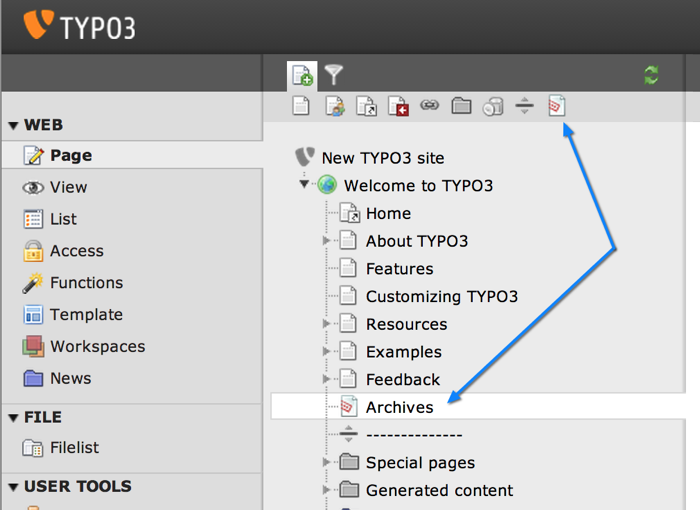

.. ==================================================
.. FOR YOUR INFORMATION
.. --------------------------------------------------
.. -*- coding: utf-8 -*- with BOM.

.. include:: ../Includes.txt

.. _page-types:

Page types
==========

Global array :code:`$PAGES_TYPES` defines the various types of pages (field: :code:`doktype`) the
system can handle and what restrictions may apply to them. Here you can define which tables are
allowed on a certain page type.

.. note::
   The "default" entry in the :code:`$PAGES_TYPES` array is the "base"
   for all types, and for every type the entries simply overrides the
   entries in the "default" type!!

This is the default array as set in :file:`EXT:core/ext_tables.php`::

   $GLOBALS['PAGES_TYPES'] = array(
    (string) \TYPO3\CMS\Frontend\Page\PageRepository::DOKTYPE_LINK => array(
    ),
    (string) \TYPO3\CMS\Frontend\Page\PageRepository::DOKTYPE_SHORTCUT => array(
    ),
    ...
    //  Doktype 254 is a 'Folder' - a general purpose storage folder for whatever you like. In CMS context it's NOT a viewable page. Can contain any element.
    (string) \TYPO3\CMS\Frontend\Page\PageRepository::DOKTYPE_SYSFOLDER => array( 
        'type' => 'sys',
        'allowedTables' => '*'
    ),
    ...
    'default' => array(
        'type' => 'web',
        'allowedTables' => 'pages',
        'onlyAllowedTables' => '0'
    )
   );

The key used in the array above is the value that will be stored in the
:code:`doktype` field of the "pages" table.

.. important::

   The choice of value for the :code:`doktype` is critical.
   If you want your custom page type to be displayed in the frontend,
   you must make sure to choose a :code:`doktype` smaller than 200.
   If it's supposed to be just some storage, choose a :code:`doktype`
   larger than 200.

Each array has the following options available:

.. t3-field-list-table::
 :header-rows: 1

 - :Key,30: Key
   :Description,70: Description

 - :Key:
         type
   :Description:
         Can be "sys" or "web". This is purely informative, as TYPO3 CMS does
         nothing with that piece of data.

 - :Key:
         allowedTables
   :Description:
         The tables that may reside on pages with that "doktype".
         Comma-separated list of tables allowed on this page doktype. "\*" =
         all.

 - :Key:
         onlyAllowedTables
   :Description:
         Boolean. If set to true, changing the page type will be blocked if
         the chosen page type contains records that it would not allow.

.. note::
   **All above options** must be set for the default type while
   the rest can choose as they like.

.. _page-types-example:

Create new Page Type
--------------------

The following example adds a new page type called "Archive".

   The new page type visible in the TYPO3 backend

The whole code to add a page type is shown below with the according file names above.

The first step is to add the new page type to the global array described above. Then you need to add
the icon chosen for the new page type and allow users to drag and drop the new page type to the page
tree.
All the changes are applied in :file:`ext_tables.php`::

    call_user_func(
        function ($extKey) {
            $archiveDoktype = 116;

            // Add new page type:
            $GLOBALS['PAGES_TYPES'][$archiveDoktype] = [
                'type' => 'web',
                'allowedTables' => '*',
            ];

            // Provide icon for page tree, list view, ... :
            \TYPO3\CMS\Core\Utility\GeneralUtility::makeInstance(\TYPO3\CMS\Core\Imaging\IconRegistry::class)
                ->registerIcon(
                    'apps-pagetree-archive',
                    TYPO3\CMS\Core\Imaging\IconProvider\SvgIconProvider::class,
                    [
                        'source' => 'EXT:' . $extKey . '/Resources/Public/Icons/Archive.svg',
                    ]
                );

            // Allow backend users to drag and drop the new page type:
            \TYPO3\CMS\Core\Utility\ExtensionManagementUtility::addUserTSConfig(
                'options.pageTree.doktypesToShowInNewPageDragArea := addToList(' . $archiveDoktype . ')'
            );
        },
        'example'
    );

Furthermore we need to modify the configuration of "pages" records. As one can modify the pages. We
need to add the new doktype as select item and associate it with the configured icon. That's done in
:file:`Configuration/TCA/Overrides/pages.php`::

    call_user_func(
        function ($extKey, $table) {
            $extRelPath = \TYPO3\CMS\Core\Utility\ExtensionManagementUtility::extRelPath($extKey);
            $customPageIcon = $extRelPath . 'Resources/Public/Images/Archive.svg';
            $archiveDoktype = 116;

            // Add new page type as possible select item:
            \TYPO3\CMS\Core\Utility\ExtensionManagementUtility::addTcaSelectItem(
                $table,
                'doktype',
                [
                    'LLL:EXT:' . $extKey . '/Resources/Private/Language/locallang.xlf:archive_page_type',
                    $archiveDoktype,
                    $customPageIcon
                ],
                '1',
                'after'
            );

            // Add icon for new page type:
            \TYPO3\CMS\Core\Utility\ArrayUtility::mergeRecursiveWithOverrule(
                $GLOBALS['TCA']['pages'],
                [
                    'ctrl' => [
                        'typeicon_classes' => [
                            $archiveDoktype => 'apps-pagetree-archive',
                        ],
                    ],
                ]
            );
        },
        'example',
        'pages'
    );

The same must be done with the "pages_language_overlay", so that the new page type
can also be translated :file:`Configuration/TCA/Overrides/pages_language_overlay.php`::

    // Also add the new doktype to the page language overlays type selector (so that translations can inherit the same type)
    call_user_func(
        function ($extKey, $table) {
            $extRelPath = \TYPO3\CMS\Core\Utility\ExtensionManagementUtility::extRelPath($extKey);
            $customPageIcon = $extRelPath . 'Resources/Public/Images/Archive.svg';
            $archiveDoktype = 116;

            // Add new page type as possible select item:
            \TYPO3\CMS\Core\Utility\ExtensionManagementUtility::addTcaSelectItem(
                $table,
                'doktype',
                [
                    'LLL:EXT:' . $extKey . '/Resources/Private/Language/locallang.xlf:archive_page_type',
                    $archiveDoktype,
                    $customPageIcon
                ],
                '1',
                'after'
            );
        },
        'example',
        'pages_language_overlay'
    );
