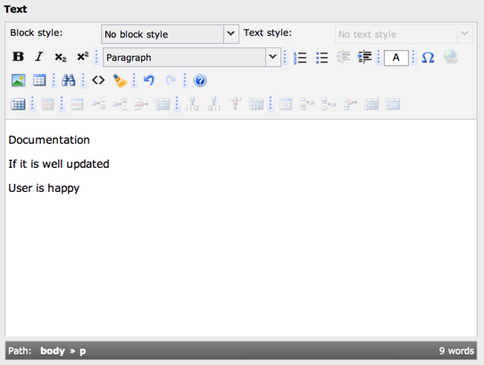

.. include:: ../../Includes.txt

.. _rte-backend:

Rich Text Editors in the TYPO3 backend
--------------------------------------

.. _rte-backend-introduction:

Introduction
^^^^^^^^^^^^

When you configure a table in :code:`$TCA` and add a field of the type "text"
which is edited by a :code:`<textarea>`, you can choose to use a Rich Text
Editor (RTE) instead of the simple form field. A RTE enables the users
to use visual formatting aids to create bold, italic, paragraphs,
tables, etc.

   The rtehtmlarea RTE activated in the TYPO3 backend

For full details about setting up a field to use a RTE, please refer to the
:ref:`t3tca:special-configuration-options` chapter in the TCA Reference.

The short story is that it's enough to add the key :code:`defaultExtras`
to the configuration of the column with the string :code:`richtext[]` as value:

.. code-block:: php
   :emphasize-lines: 9,9

   'poem' => array(
       'exclude' => 0,
      'label' => 'LLL:EXT:examples/locallang_db.xml:tx_examples_haiku.poem',
      'config' => array(
         'type' => 'text',
         'cols' => 40,
         'rows' => 6
      ),
      'defaultExtras' => 'richtext[]'
   ),

This works for FlexForms too.

.. note::

   Don't forget to enable Rich Text Editor in the back end, in User Settings -> Edit and Advanced functions,
   check "Enable Rich Text Editor", if not already done.

.. toctree::
   :maxdepth: 5
   :titlesonly:
   :glob:

   PlugRte/Index

