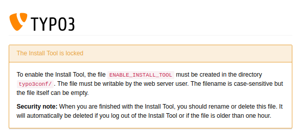

.. include:: /Includes.rst.txt
.. index::
   Security guidelines; Install tool
   File; typo3conf/ENABLE_INSTALL_TOOL
.. _security-install-tool:

============
Install tool
============

The Install Tool allows you to configure the TYPO3 system on a very
low level, which means, not only the basic settings but also the most
essential settings can be changed. You do not necessarily need a TYPO3
backend account to access the Install Tool, so it is clear that the
Install Tool requires some special attention (and protection).

TYPO3 already comes with a two step mechanism out-of-the-box to
protect the Install Tool against unauthorized access: the first
measure is a file called :file:`ENABLE_INSTALL_TOOL` which must exist if
the Install Tool should be accessible. The second mechanism is a
password protection, which is independent of all backend user
passwords.

The Install Tool can found as a stand alone application via ``https://<domain.tld>/typo3/install.php``.
It also integrates with the backend, but is only available for logged in users with administrator privileges.

The :file:`ENABLE_INSTALL_TOOL` file can be created by putting an empty
file into the :ref:`config directory<Environment-config-path>`. You usually
need write access to this directory on a server level (for example via SSH, SFTP, etc.)
or you can create this file as a backend user with administrator
privileges.

Conversely, this also means, you should delete this file as soon as
you do not need to access the Install Tool any more. It should also be
mentioned that TYPO3 deletes the :file:`ENABLE_INSTALL_TOOL` file
automatically if you logout of the Install Tool or if the file is
older than 60 minutes (expiry time). Both features can be deactivated
if the content of this file is `KEEP_FILE`, which is understandably
not recommended.

The password for accessing the Install Tool is stored using the
:ref:`configured password hash mechanism <password-hashing>` set for the backend
in the global configuration file :file:`typo3conf/LocalConfiguration.php`::

   'BE' => 'installToolPassword' = '$P$CnawBtpk.D22VwoB2RsN0jCocLuQFp.'

Since TYPO3 version 6.2, the Install Tool password is set during the
installation process. This means, in the case that a system administrator
hands over the TYPO3 instance to you, it should also provide you
with the appropriate password.

The first thing you should do, after taking over a new TYPO3 system from
a system administrator, is to change the password to a new and secure one.
Log-in to the Install Tool and change it there.

.. figure:: ../../Images/Security/change-install-tool-password.png
    :class: with-shadow
    :alt: Screen to change the Install Tool password

Since TYPO3 v9, the role of system maintainer has been introduced. It allows for selected
BE users to access the Install Tool components from within the backend without further
security measures.
The number of system maintainers should be as small as possible to mitigate the risks of corrupted accounts.

The role can be provided in the Settings Section of the Install Tool -> Manage System Maintainers. It is also
possible to manually modify the list by adding or removing the be_users.uid of the user in :file:`LocalConfiguration.php`::

    'SYS' => 'SystemMaintainers' => [1, 7, 36]

For additional security, the folders :file:`typo3/install` and :file:`typo3/sysext/install`
can be deleted, or password protected on a server level (e.g. by a web
server's user authentication mechanism). Please keep in mind that
these measures have an impact on the usability of the system. If you
are not the only person who uses the Install Tool, you should
definitely discuss your intention with the team.

TYPO3 Core updates
==================

Since TYPO3 CMS 6.2, the Install Tool allows integrators to update the
TYPO3 Core with a click of a button. This feature can be found under
"Important actions" and it checks/installs revision updates only (e.g.
bug fixes and security updates).

.. figure:: ../../Images/Security/core-updates.png
    :class: with-shadow
    :alt: Install Tool function to update the TYPO3 Core

It should be noted that this feature can be disabled by an environment
variable::

   TYPO3_DISABLE_CORE_UPDATER=1

.. index:: Security guidelines; Encryption key
.. _security-encryption-key:

Encryption key
==============

The `encryptionKey` can be found in the Install Tool (module
*Settings > Configure Installation-Wide Options*). This string, usually a
hexadecimal hash value of 96 characters, is used as the "salt" for
various kinds of encryption, check sums and validations (e.g. for
the `cHash`). Therefore, a change of this value invalidates temporary
information, cache content, etc. and you should clear all caches after
you changed this value in order to force the rebuild of this data with
the new encryption key.

Keep in mind that this string is security-related and you should keep
it in a safe place.
