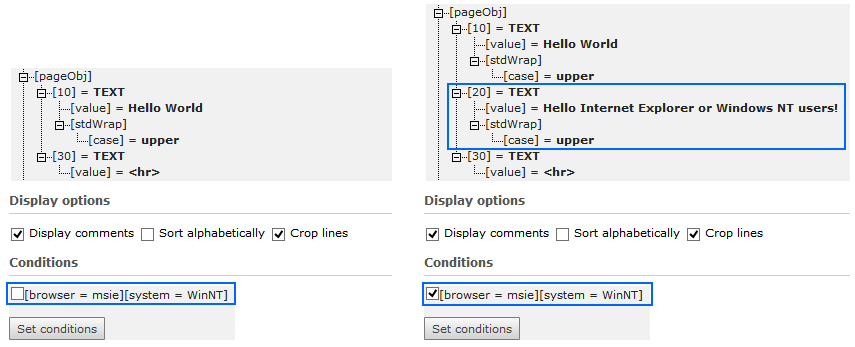
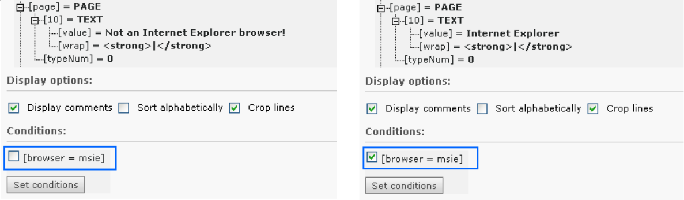
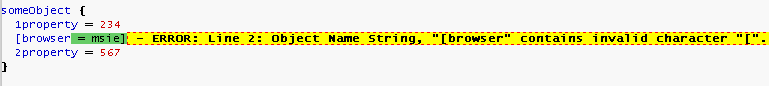

.. ==================================================
.. FOR YOUR INFORMATION
.. --------------------------------------------------
.. -*- coding: utf-8 -*- with BOM.

.. include:: ../../Includes.txt

.. _conditions:

Conditions
^^^^^^^^^^

There is a *possibility* of using so called *conditions* in
TypoScript. Conditions are simple control structures, that evaluate to
TRUE or FALSE based on some criteria (externally validated) and
thereby determine, whether the TypoScript code following the condition
and ending where the next condition is found, should be parsed or not.

Examples of a condition could be:

- Is the browser "Internet Explorer"?

- Is a usergroup set for the current session?

- Is it Monday?

- Is the GET parameter "&language=uk" set?

- Is it my mother's birthday?

- Do I feel lucky today?

Of these examples admittedly the first few are the most realistic. In
fact they are readily available in the context of TypoScript
Templates. But a condition can theoretically evaluate any circumstance
and return either TRUE or FALSE which subsequently means the parsing
of the TypoScript code that follows.

.. _conditions-usage:

Where conditions can be used
""""""""""""""""""""""""""""

The *detection of conditions* is a part of the TypoScript syntax but
the *validation* of the condition content always relies on the
context where TypoScript is used. Therefore in plain syntax
highlighting (no context) conditions are just highlighted and nothing
more. In the context of TypoScript Templates there is a `whole section
of :ref:`TSref <t3tsref:conditions>` which defines the
syntax of the condition contents for TypoScript Templates. For "Page
TSconfig" and "User TSconfig" conditions are implemented since TYPO3
4.3. Basically they work the same way as conditions in TypoScript
templates do, but there are some small differences. For details see
the according `section "Conditions" in :ref:`TSconfig
<t3tsconfig:conditions>`.

.. _conditions-syntax:

The syntax of conditions
""""""""""""""""""""""""

A condition always has its own line and the line is detected by " [ "
(square bracket) being the first character on that line::

   (Some TypoScript)

   [ condition 1 ][ condition 2]

   (Some TypoScript only parsed if condition 1 or condition 2 are met.)

   [GLOBAL]

   (Some TypoScript)

As you can see from this example, the line " **[GLOBAL]** " also is a
condition. It is built-in into TypoScript and always returns TRUE. The
line "[ condition 1 ][ condition 2]" is another condition. If "[
condition 1 ][ condition 2]" is TRUE, then the TypoScript in the
middle would be parsed until [GLOBAL] (or [END]) resets the
conditions. After that point the TypoScript is parsed for any case
again.

**Notice:** The condition line "[ condition 1 ][ condition 2]" conveys
the idea of *two conditions* being set, but from the TypoScript
parsers point of view the *whole line* is the condition - it is in the
context of TypoScript Templates that the condition line content is
broken down into smaller units ("[ condition 1 ]" and "[ condition
2]") which are individually evaluated and connected by a logical OR
before they return the resulting TRUE or FALSE value. (That is all
done with the class AbstractConditionMatcher (t3lib\_matchCondition)).

Here is an example of some TypoScript (from the context of TypoScript
Templates) where another text is output if you use the Microsoft
Internet Explorer web browser (instead of for example Google Chrome)
or use Windows NT as operating system::

   pageObj.10 = TEXT
   pageObj.10.value = Hello World
   pageObj.10.case = upper

   [browser = msie][system = WinNT]
   pageObj.20 = TEXT
   pageObj.20 {
     value = Hello Internet Explorer or Windows NT users!
     case = upper
   }

   [GLOBAL]
   pageObj.30 = TEXT
   pageObj.30.value = 

You can now use the Object Browser to actually see the difference in
the parsed object tree depending on whether the condition evaluates to
TRUE or FALSE (which can be simulated with that module as you can
see):

         a condition is set or unset.

.. _else-condition:
.. _end-condition:
.. _global-condition:

The special [ELSE], [END] and [GLOBAL] conditions
"""""""""""""""""""""""""""""""""""""""""""""""""

There's a special condition called [ELSE] which will return TRUE if
the previous condition returned FALSE. To end an [ELSE] condition you
can use either [END] or [GLOBAL]. For all three conditions you can
also use them in lower case.

Here's an example of using the [ELSE]-condition (also in the context
of TypoScript Templates)::

   page.typeNum = 0
   page = PAGE
   page.10 = TEXT

   [browser = msie]
   page.10.value = Internet Explorer

   [else]
   page.10.value = Not an Internet Explorer browser!

   [end]

   page.10.wrap = <strong>|</strong>

Here we have one output text if the browser is Internet Explorer and
another if not. Anyways the text is wrapped by <strong>\|</strong> as
we see, because this wrap is added outside of the condition block
(here after the [END]-condition).

The fact that you can "enable" the condition in the TypoScript Object
Browser is a facility provided to simulate the outcome of any
conditions you insert in a TypoScript Template. Whether or not the
conditions validate correctly is only verified by actually getting a
(in this example) Internet Explorer browser and hitting the site.

Another example could be if you wanted to do something special in case
a bunch of conditions is NOT true. There's **no negate-character**,
but you could do this::

   [browser = msie][usergroup = 3]
     # Enter nothing here!
   [else]
     page.10.value = This text is only displayed if the conditions above are not TRUE!
   [end]

.. _conditions-confinements:
.. _conditions-braces:

Where to insert conditions in TypoScript?
"""""""""""""""""""""""""""""""""""""""""

Conditions can be used *outside* of confinements (curly braces) only!

So, this is valid::

   someObject {
     1property = 234
   }
   [browser = msie]
   someObject {
     2property = 567
   }

But this is **not valid:** ::

   someObject {
     1property = 234
     [browser = msie]
     2property = 567
   }

When parsed with syntax highlighting you will see this error:

This means that the line was perceived as a regular definition of
"[object path] [operator] [value]" and not as a condition.

.. _the-global-condition:

The [GLOBAL] condition
""""""""""""""""""""""

However for the special condition [GLOBAL] (which resets any previous
condition scope), it is a bit different since that will be detected at
*any line* except within multiline value definitions. ::

   someObject {
     1property = 234
     [GLOBAL]
     2property = 567
   }

But you will still get some errors if you syntax highlight it:

.. figure:: ../../Images/ConditionsSyntaxErrorGlobal.png
   :alt: Error after having used a GLOBAL condition at thw wrong place.

The reason for this is that the [GLOBAL] condition aborts the
confinement started in the first line resulting in the first error
("... short of 1 end brace(s)"). The second error appears because the
end brace is now in excess since the "brace level" was reset by
[GLOBAL].

So, in summary; the special [global] (or [GLOBAL]) condition will
break TypoScript parsing within braces at any time and return to the
global scope (unless entered in a multiline value). This is true for
any TypoScript implementation whether other condition types are
possible or not. Therefore you can use [GLOBAL] (put on a single line
for itself) to make sure that following TypoScript is correctly parsed
from the top level. This is normally done when TypoScript code from
various records is combined.

.. _conditions-summary:

Summary
"""""""

- Conditions are detected by "[" as the first line character (whitespace
  ignored).

- Conditions are evaluated in relation to the context where TypoScript
  is used. They are widely used in TypoScript Templates and can also be
  used in "Page TSconfig" or "User TSconfig".

- Special conditions [ELSE], [END] and [GLOBAL] exist.

- Conditions can be used outside of confinements (curly braces) only.
  However the [GLOBAL] condition will always break a confinement if
  entered inside of one.

