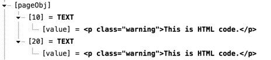
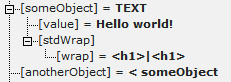

.. include:: ../../Includes.txt

.. _typoscript-syntax:

TypoScript syntax
^^^^^^^^^^^^^^^^^

TypoScript is parsed in a very simple way; line by line. This means
that abstractly said each line normally contains three parts based on
this formula:

.. code-block:: text

   [Object Path] [Operator] [Value]

Example:
""""""""

.. code-block:: typoscript

   myObject.myProperty = value 2

.. _syntax-object-path:

object path
"""""""""""

The object path (in this case :code:`myObject.myProperty`) is like the
variable name in a programming language. The object path is the first
block of non-whitespace characters on a line until one of the
characters :code:`=<>{(` or a white space is found. The dot (:code:`.`) is used
to separate objects and properties from each other creating a hierarchy.
Here we have the object :code:`myObject` with the property :code:`myProperty`.
**Use only A-Z, a-z, 0-9, "-", "\_" and periods (.) for object paths!**

Dots in the object path can be escaped using a backslash.

**Example:**

.. code-block:: typoscript

   my\.escaped\.key = test

This will result in an object named :code:`my.escaped.key` with the value "test".
Here we do **not** have three hierarchically structured objects :code:`my`,
:code:`escaped` and :code:`key`.

.. _syntax-operator:

operator
""""""""

The operator (in the example it is :code:`=`) can be one of the characters
:code:`=<>{(`. The various operators are described below.

.. _syntax-value:

value
"""""

The value (in case of the above example "value 2") is whatever characters
follow the operator until the end of the line, but trimmed for whitespace
at both ends. Notice that values are *not* encapsulated in quotes! The
value starts after the operator and ends with the line break.

.. _syntax-comments:

Comments
""""""""

When a line starts with :code:`/` or :code:`#` it is considered to be a comment
and will be ignored.

Example:
~~~~~~~~

.. code-block:: typoscript

   // This is a comment
   / This also is a comment (only ONE slash is needed)
   myObject = TEXT
   myObject.value = <strong>Some HTML code</strong>
   # This line also is a comment.

.. _syntax-comment-blocks:

Comment blocks
""""""""""""""

When a line starts with :code:`/*` or :code:`*/` it defines the beginning or the
end of a comment section respectively. Anything inside a comment
section is ignored.

Rules:
~~~~~~

:code:`/*` and :code:`*/` **must** be the very first characters of a trimmed line in
order to be detected.

Comment blocks are not detected inside a multi-line value block (see
parenthesis operator below).

Example:
~~~~~~~~

.. code-block:: typoscript

   /* This is a comment
    .. and this line is within that comment which...
     ends here:
   */  ... this is not parsed either though - the whole line is still within the comment
   myObject = TEXT
   myObject.value (
      Here is a multiline value which
      /*
       This is not a comment because it is inside a multi-line value block
      */
   )

.. _syntax-equal-operator:
.. _syntax-value-assignment:

Value assignment: The "=" operator
""""""""""""""""""""""""""""""""""

This simply assigns a value to an object path.

Rules:
~~~~~~

Everything after the :code:`=` sign and *up to the end of the line* is
considered to be the value. In other words: You don't need to quote
anything!

Be aware that the value will be trimmed, which means stripped of
whitespace at both ends.

.. _syntax-colon-equal-operator:
.. _syntax-value-modification:

Value modifications: The ":=" operator
""""""""""""""""""""""""""""""""""""""

This operator assigns a value to an object path by calling a
predefined function which modifies the existing value of the current
object path in different ways.

This is very useful when a value should be modified without completely
redefining it again.

Rules:
~~~~~~

The portion after the :code:`:=` operator and *to the end of the line* is
split in two parts: A function and a value. The function is specified
right next to the operator (trimmed) and holding the value in parentheses
(not trimmed).

This is the list of predefined functions:

prependString
  Adds a string to the beginning of the existing
  value.

appendString
  Adds a string to the end of the existing value.

removeString
  Removes a string from the existing value.

replaceString
  Replaces old with new value. Separate these using
  :code:`|`.

addToList
  Adds a comma-separated list of values to the end of a
  string value. There is no check for duplicate values, and the list is
  not sorted in any way.

removeFromList
  Removes a comma-separated list of values from an
  existing comma-separated list of values.

uniqueList
  Removes duplicate entries from a comma-separated list
  of values.

reverseList
  Reverses the order of entries in a comma-separated
  list of values.

sortList
  Sorts the entries in a comma-separated list of values.

  Optional parameters are

  ascending
    Sort the items in ascending order: First numbers
    from small to big, then letters in alphabetical order. This is the
    default method.

  descending
    Sort the items in descending order: First letters
    in descending order, then numbers from big to small.

  numeric
    Apply numeric sorting: Numbers from small to big,
    letters sorted after "0".

  Multiple parameters are separated by comma.

There is a hook inside class :code:`\TYPO3\CMS\Core\TypoScript\Parser\TypoScriptParser`
which can be used to define more such functions.

Example:
~~~~~~~~

.. code-block:: typoscript

   myObject = TEXT
   myObject.value = 1,2,3
   myObject.value := addToList(4,5)
   myObject.value := removeFromList(2,1)

produces the same result as:

.. code-block:: typoscript

   myObject = TEXT
   myObject.value = 3,4,5

.. _syntax-code-blocks:
.. _syntax-curly-brackets:

Code blocks: The { } signs
""""""""""""""""""""""""""

Opening and closing curly braces are used to assign many object
properties in a simple way at once. It's called a block or nesting of
properties.

Rules:
~~~~~~

- Everything on the same line as the opening brace (:code:`{`), but that comes
  *after* it is ignored.

- The :code:`}` sign *must* be the first non-space character on a line in
  order to close the block. Everything on the same line, but after :code:`}`
  is ignored.

- Blocks can be nested. This is actually recommended for **improved
  readability**.

.. important::

   You cannot use conditions inside of braces (except the
   :code:`[GLOBAL]` condition which will be detected and reset the brace-level to
   zero)

.. note::

  Excessive end braces are ignored, but generate warnings in
  the TypoScript parser.

Example:
~~~~~~~~

.. code-block:: typoscript

   myObject = TEXT
   myObject.stdWrap.field = title
   myObject.stdWrap.ifEmpty.data = leveltitle:0

could also be written as:

.. code-block:: typoscript

   myObject = TEXT
   myObject {
           stdWrap {
                   field = title
                   ifEmpty {
                           data = leveltitle:0
                   }
           }
   }

.. _syntax-round-brackets:
.. _syntax-multiline-values:

Multi-line values: The ( ) signs
""""""""""""""""""""""""""""""""

Opening and closing parenthesis are used to assign a *multi-line
value* . With this method you can define values which span several
lines and thus include line breaks.

Rules:
~~~~~~

The end-parenthesis is extremely important. If it is not
found, the parser considers the following lines to be part of the
value and does not return to parsing TypoScript. This includes the
:code:`[GLOBAL]` condition which will not save you in this case! So don't miss
it!

Example:
~~~~~~~~

.. code-block:: typoscript

   myObject = TEXT
      myObject.value (
      

         This is HTML code.
      

   )

.. _syntax-smaller-than-operator:
.. _syntax-object-copying:

Object copying: The "<" sign
""""""""""""""""""""""""""""

The :code:`<` sign is used to copy one object path to another. The whole
object is copied - both value and properties - and it overrides any
old objects and values at that position.

Example:
~~~~~~~~

.. code-block:: typoscript

   myObject = TEXT
   myObject.value = 
This is HTML code.

   myOtherObject < myObject

The result of the above TypoScript is two independent sets of
objects/properties which are exactly the same (duplicates). They are
*not* references to each other but actual copies:

.. figure:: ../../Images/SyntaxCopying1.png
   :alt: An object and its copy

Another example with a copy within a code block:

.. code-block:: typoscript

   pageObj {
           10 = TEXT
           10.value = 
This is HTML code.

           20 < pageObj.10
   }

Here also a copy is made, although inside the :code:`pageObj` object. Note
that the copied object is referred to with its full path
(:code:`pageObj.10`). When **copying on the same level**, you can just
refer to the copied object's name, **prepended by a dot**.

The following produces the same result as above:

.. code-block:: typoscript

   pageObj {
           10 = TEXT
           10.value = 
This is HTML code.

           20 < .10
   }

which – in tree view – translates to:

.. important::

   When the original object is changed after copying, the
   copy does not change! Take a look at the following code:

   .. code-block:: typoscript

      someObject = TEXT
      someObject {
              value = Hello world!
              stdWrap.wrap = 
|

      }
      anotherObject < someObject
      someObject.stdWrap.wrap = <h1>|<h1>

   The value of the :code:`stdWrap.wrap` property of :code:`anotherObject`
   is :code:`
|
`. It is **not** :code:`<h1>|<h1>` because this change
   happens **after** the copying. This example may seem trivial, but
   it's easy to loose the oversight in larger pieces of TypoScript.

.. _syntax-equal-smaller-than-operator:
.. _syntax-object-referencing:

References: the "=<" sign
"""""""""""""""""""""""""

**In the context of TypoScript Templates** it is possible to create
references from one object to another. References mean that multiple
positions in an object tree can use the same object at another
position without making an actual copy of the object but by simply
pointing to the objects full object path.

The obvious advantage is that a **change of code to the original
object affects all references**. It avoids the risk mentioned above
with the copy operator to forget that a change at a later point does
not affect earlier copies. On the other hand there's the reverse risk:
It is easy to forget that changing the original object will have an
impact on all references. References are very convenient, but should
be used with caution.

Example:
~~~~~~~~

.. code-block:: typoscript

   someObject = TEXT
   someObject {
           value = Hello world!
           stdWrap.wrap = 
|

   }
   anotherObject =< someObject
   someObject.stdWrap.wrap = <h1>|<h1>

In this case, the :code:`stdWrap.wrap` property of :code:`anotherObject`
will indeed be :code:`<h1>|<h1>`. In tree view the properties
of the reference are not shown. Only the reference itself is visible:

Remember:

- References are only available in TypoScript templates, not in TSconfig
  (User TSconfig or Page TSconfig)

- References are only resolved for Content Objects, otherwise references are
  not resolved. For example, you **cannot** use a
  reference :code:`< plugin.tx_example.settings.foo` to find the value of `foo`.
  The value you get will be just :code:`< plugin.tx_example.settings.foo` instead.

.. _syntax-bigger-than-operator:
.. _syntax-unsetting-operator:

Object unsetting: The ">" Sign
""""""""""""""""""""""""""""""

This is used to unset an object and all of its properties.

Example:
~~~~~~~~

.. code-block:: typoscript

   myObject = TEXT
   myObject.value = <strong> HTML - code </strong>

   myObject >

In this last line :code:`myObject` is totally wiped out (removed).

.. _syntax-square-brackets:
.. _syntax-conditions:

Conditions: Lines starting with "["
"""""""""""""""""""""""""""""""""""

Conditions break the parsing of TypoScript in order to evaluate the
content of the condition line. If the evaluation returns true, parsing
continues, otherwise the following TypoScript is ignored until the
next condition is found, at which point a new evaluation takes place.
The next section in this document describes conditions in more
details.

Rules:
~~~~~~

Conditions apply *only* when outside of any code block (i.e. outside
of any curly braces).

Example:
~~~~~~~~

.. code-block:: typoscript

   [browser = msie]
   page.10.value = Internet Explorer
   [ELSE]
   page.10.value = Not an Internet Explorer browser!
   [END]

