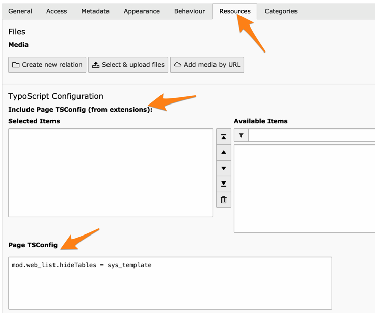

.. include:: ../Includes.txt

.. _tsconfig:

TSconfig
--------

TSconfig can be used in page (it is then referred to as
"Page TSconfig") or for backend users and backend user groups
(in which case it is known as "User TSconfig").

The Page TSconfig for any given page can be viewed using the
**WEB > Info** module and choosing the "Page TSconfig" action.

.. figure:: ../Images/TSconfigOverview.png
   :alt: Viewing Page TSconfig using the Info module

There is no way to view User TSconfig.

While the objects, properties and conditions are different,
the *syntax* of TSconfig is basically the same as it is for
TypoScript in TypoScript templates, except for constants,
which are not available in TSconfig.

The objects, properties and conditions, which are available in
Page and User TSconfig, can be found in the
:ref:`TSconfig Reference <t3tsconfig:start>`.

.. _tsconfig-page:

Entering Page TSconfig
^^^^^^^^^^^^^^^^^^^^^^

There are two ways to attach Page TSconfig to any given page.
When editing a page, move to the "Resources" tab. The first
way is to include a TSconfig file provided by an extension
(new since TYPO3 CMS 7). The second is to directly enter code
in the "Page TSConfig" field.

Page TSconfig is inherited along the page tree. Consider
the TSconfig from the above screenshot:

.. code-block:: typoscript

   mod.web_list.hideTables = sys_template

It means that we want to fully hide the "sys\_template" table
on the page where we defined this TSconfig and **all** of its
child pages.

Page TSconfig is thus very convenient to have separate branches
of the page tree behave differerently.

.. _tsconfig-user:

Entering User TSconfig
^^^^^^^^^^^^^^^^^^^^^^

User TSconfig is entered in the "TSconfig" field of either
BE users or BE user groups records. For both, this field
is located in the "Options" tab.

.. figure:: ../Images/TSconfigUserInput.png
   :alt: The TSconfig field in the Options tab of a BE user

TSconfig defined at user-level is considered more relevant
than TSconfig defined at group-level. Thus if the same property
is defined both for a group the user belongs to and for the user
itself, the value defined for the user will prevail.

If a user is member of several groups, the TSconfig from each
group will simply be accumulated, identical properties from
later groups taking precedence over definitions from earlier
groups.
