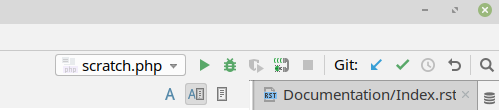

.. include:: /Includes.rst.txt
.. index:: pair: Testing; Core
.. _testing-core:

============
Core testing
============

Introduction
============

This chapter is about executing TYPO3 core tests locally and is intended to give you a better understanding of testing within TYPO3's core. A full core git checkout comes with everything needed
to run tests in TYPO3 as of version 9. We don't use older versions in this chapter
since core development is most likely bound to the core master branch - back porting patches to older
branches are usually handled by core maintainers and often don't affect other core contributors.

Note, the main script :file:`Build/Scripts/runTests.sh` is relatively new. It works best
when executed on a Linux based host but can be run under macOS and Windows with some performance drawbacks on macOS.

Additionally, it *is* possible to execute tests on a local system without using Docker. Depending on
which test suite is executed, developers may need to configure their environments to run the
desired test. We however learned not too many people actually do that as it can become tricky. This
chapter does not talk about test execution outside of :file:`Build/Scripts/runTests.sh`.

.. _testing-core-dependencies:

System dependencies
===================

Many developers are familiar with `Docker <https://www.docker.com/>`_. As outlined in the
:ref:`history <testing-history>` chapter, test execution needs a well defined, isolated, stable and
reliable environment to run tests and also remove the need to manage niche dependencies on your local
environment for tests such as "execute functional test "X" using MSSQL with xdebug".

Git, docker and docker-compose are all required. For standalone test execution, a local installation of
PHP is not required. You can even `composer install` a core by calling `Build/Scripts/runTests.sh -s
composerInstall` in a container.

If you're using a Mac, install or update Docker to the most recent version using the packaging system of
your choice.

If you are using Ubuntu Linux 18.04 or higher, everything should be ok after
calling `sudo apt-get install git docker docker-compose` once. For other Linux distributions
including older releases of Ubuntu, users should have a look at the Docker homepage to see how to update
to a recent version. It usually involves adding some other package repository and updating / installing using it.
Make sure your local user is a member of the `docker` group, else the script will fail with something like
`/var/run/docker.sock: connect: permission denied`.

Windows can rely on WSL to have a decent docker version, too.

Quick start
===========

From now on, it is assumed that git, docker and docker-compose are available with the most up-to-date release
running on the host system. Executing the basic core unit test suite boils down to:

.. code-block:: shell

    # Initial core clone
    git clone git://git.typo3.org/Packages/TYPO3.CMS.git && cd TYPO3.CMS
    # Install composer dependencies
    Build/Scripts/runTests.sh -s composerInstall
    # Run unit tests
    Build/Scripts/runTests.sh

That's it. You just executed the entire unit test suite.
initial core clone and a composer install, other parts of this chapter are about different permutations of.
Now that we have examined the initial core clone and a composer install process, we will then look at the
different ways we can apply the `runTests.sh` or other scenarios

Overview
========

So what just happened? We cloned a core, composer install`ed dependencies and executed core
unit tests. Let's have a look at more some details: `runTests.sh` is a shell script that figures out
which test suite with which options a user wants to execute, does some error handling for broken
combinations, writes the file `Build/testing-docker/local/.env` according to its findings and then executes a
couple of `docker-compose` commands to prepare containers, run tests and stop containers after execution
again.

A core developer doing this for the first time may notice `docker-compose` pulling several container images
before continuing. These are the dependent images needed to execute certain jobs. For instance the
container `typo3gmbh/php72 <https://hub.docker.com/r/typo3gmbh/php72/>`_ may be fetched. It's definition
can be found at `TYPO3 GmbH bitbucket <https://bitbucket.typo3.com/projects/T3COM/repos/bamboo-remote-agent/browse>`_.
These are the exact same containers Bamboo based testing is executed in. In Bamboo, the combination of
:file:`Build/bamboo/src/main/java/core/PreMergeSpec.java` and :file:`Build/testing-docker/bamboo/docker-compose.yml`
specify what Bamboo executes for patches pushed to the review system. On local testing, this is the
combination of :file:`Build/Scripts/runTests.sh`, :file:`Build/testing-docker/local/.env` (created by
runTests.sh) and :file:`Build/testing-docker/local/docker-compose.yml`.

Whats impressive is that runTests.sh can do everything locally that Bamboo executes as `pre-merge
<https://bamboo.typo3.com/browse/CORE-GTC>`_ tests at the same time. It's just that the combinations of tests
and splitting to different jobs is slightly different, for instance Bamboo does multiple tests in
the "integration" test at once that are single "check" suites in runTests.sh. But if a patch is
pushed to Bamboo and it complains about something being broken, it is possible to replay and fix the
failing suite locally to then push an updated patch and hopefully enable the Bamboo test to pass.

A runTests.sh run
=================

Let's pick a runTests.sh example and have a closer look:

.. code-block:: shell

    lolli@apoc /var/www/local/cms/Web $ Build/Scripts/runTests.sh -s functional typo3/sysext/core/Tests/Functional/Authentication/
    Creating network "local_default" with the default driver
    Creating local_redis4_1       ... done
    Creating local_mariadb10_1    ... done
    Creating local_memcached1-5_1 ... done
    Waiting for database start...
    Database is up
    PHP 7.2.11-3+ubuntu18.04.1+deb.sury.org+1 (cli) (built: Oct 25 2018 06:44:08) ( NTS )
    PHPUnit 7.1.5 by Sebastian Bergmann and contributors.

    .                                                                   1 / 1 (100%)

    Time: 184 ms, Memory: 16.00MB

    OK (1 test, 1 assertion)
    Stopping local_mariadb10_1    ... done
    Stopping local_redis4_1       ... done
    Stopping local_memcached1-5_1 ... done
    Removing local_functional_mariadb10_run_1         ... done
    Removing local_prepare_functional_mariadb10_run_1 ... done
    Removing local_mariadb10_1                        ... done
    Removing local_redis4_1                           ... done
    Removing local_memcached1-5_1                     ... done
    Removing network local_default
    lolli@apoc /var/www/local/cms/Web $ echo $?
    0
    lolli@apoc /var/www/local/cms/Web $

The command asks runTests.sh to execute the "functional" test suite `-s functional` and to not execute all
available tests but only those within `typo3/sysext/core/Tests/Functional/Authentication/`. The script first
starts the containers it needs: Redis, memcached and a MariaDB. All in one network. It then waits until
the MariaDB container opens its database port, then starts a PHP 7.2 container and calls phpunit to execute
the tests. phpunit executes only one test in this case, that one is green. The containers and networks are then
removed again. Note the exit code of runTests.sh (`echo $?`) is identical to the exit code of the phpunit
call: If phpunit reports green, runTests.sh returns 0, and if phpunit is red, the exit code would be non zero.

.. _testing-core-examples:

Examples
========

First and foremost, the most important call is `-h` - the help output. The output below is cut, but
the script returns a useful overview of options. The help output is also returned if given options
are not valid:

.. code-block:: shell

    lolli@apoc /var/www/local/cms/Web $ Build/Scripts/runTests.sh -h
    TYPO3 core test runner. Execute acceptance, unit, functional and other test suites in
    a docker based test environment. Handles execution of single test files, sending
    xdebug information to a local IDE and more.
    ...

Some further examples: The most important tests suites are unit tests, functional tests and acceptance
tests, but there is more:

.. code-block:: shell

    # Execute the unit test suite with PHP 7.3
    Build/Scripts/runTests.sh -s unit -p 7.3

    # Execute some backend acceptance tests
    Build/Scripts/runTests.sh -s acceptance typo3/sysext/core/Tests/Acceptance/Backend/Topbar/

    # Execute some functional tests with PHP 7.3 and postgres DBMS
    Build/Scripts/runTests.sh -s functional -p 7.3 -d postgres typo3/sysext/core/Tests/Functional/Package/

    # Execute the cgl fixer
    Build/Scripts/runTests.sh -s cglGit

    # Verbose runTests.sh output. Shows main steps and composer commands for debugging
    Build/Scripts/runTests.sh -v

As shown there are various combinations available. Just go ahead, read the help output and play around.
There are tons of further test suites to try.

One interesting detail should be mentioned: runTests.sh uses `typo3gmbh/phpXY <https://hub.docker.com/r/typo3gmbh/>`_
as main PHP containers. Those are loosely maintained and may be updated. Use the command
`Build/Scripts/runTests.sh -u` to fetch the latest versions of these containers.

.. index::
   Testing; Debugging
   Testing; Xdebug
   Debugging
   Xdebug

Debugging
=========

To speed up test execution, the PHP extension `xdebug` is not usually loaded.
However, to allow debugging tests and system under tests, it is possible to
activate xdebug and send debug output to a local IDE. We'll use PhpStorm for this example.

Let's verify our PhpStorm debug settings first. Go to File > Settings > Languages & Frameworks > PHP
> Debug. Make sure "Can accept external connections" is enabled, remember the port if it is not the
default port(9000) and also raise "Max. simultaneous connections" to two or three. Note remote debugging
may impose a security risk since everyone on the network can send debug streams to your host.

.. figure:: ../Images/PhpstormXdebugSettings.png
    :class: with-shadow
    :alt: Phpstorm debug settings window

Accept changes and enable "Start listening for PHP connections". If you changed settings, turn them
off and on once to read new settings.

Now set a break point in an assignment. Note break points do not work "everywhere", for instance
not on empty lines and not on array assignments. The best way is to use a straight command. We'll use
a simple test file for now, add a breakpoint and then execute this test. If all goes well, PhpStorm
stops at this line and opens the debug window.

.. figure:: ../Images/PhpstormDebugSession.png
    :class: with-shadow
    :alt: Phpstorm with active debug session

.. code-block:: shell

    Build/Scripts/runTests.sh -x -s functional -p 7.3 -d postgres typo3/sysext/core/Tests/Functional/Package/RuntimeActivatedPackagesTest.php

The important flag here is `-x`! This is available for unit and functional testing. It enables xdebug
in the PHP container and sends all debug information to port 9000 of the host system. If a local PhpStorm
is listening on a non-default port, a different port can be specified with `-y`.

If PhpStorm does *not* break as expected, some adjustments in this area may be required. First, make
sure "local" debugging works. Set a breakpoint in a local project and see if it works. If it works
locally, the container based debugging should also work. Next, make sure a proper break point has been set.
Additionally, it may be useful to activate "Break at first line in PHP scripts" in your PhpStorm settings. runTests.sh
mounts the local path to the same location within the container, so path mapping is not needed. PhpStorm
also comes with a `guide <https://www.jetbrains.com/help/phpstorm/configuring-xdebug.html>`_ how to set up
debugging.
