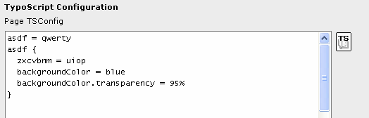
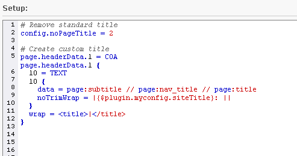

.. ==================================================
.. FOR YOUR INFORMATION
.. --------------------------------------------------
.. -*- coding: utf-8 -*- with BOM.

.. include:: ../../Includes.txt

.. _entering-typoscript:

Entering TypoScript
^^^^^^^^^^^^^^^^^^^

Since TypoScript has a line-based syntax which most of all resembles
what is found in simple text based configuration files, it is also
authored in ordinary textarea input fields inside of TYPO3. An example
is the "TSconfig" box of a regular page header:

This is how TypoScript is typically entered - directly in form fields.
A JavaScript-based editor is available for TypoScript templates. It
provides line-numbering, syntax highlighting and auto-completion.

If you don't see the code with syntax highlighting as in the
screenshot above, make sure the system extension "t3editor" is loaded.
Also the editor is available only when editing TypoScript from the Web
> Template module (function: "Info/Modify") and not when editing the
whole template record.

Other helpful features:

- There is the "TS wizard" icon which is often found to the right of the
  textarea - this can help you finding properties for the current
  TypoScript context.

- There also is the ability to insert an include-tag in any TypoScript
  field (see later in this document) which refers to an external file
  which can contain TypoScript - and that file can be edited with an
  external editor with whatever benefits that has.

