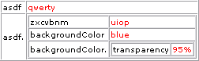

.. ==================================================
.. FOR YOUR INFORMATION
.. --------------------------------------------------
.. -*- coding: utf-8 -*- with BOM.

.. include:: ../../Includes.txt

.. _parsing-storing-executing-typoscript:

Parsing, storing and executing TypoScript
^^^^^^^^^^^^^^^^^^^^^^^^^^^^^^^^^^^^^^^^^

.. _parsing-typoscript:

Parsing TypoScript
""""""""""""""""""

This means that the TypoScript text content is transformed into a PHP
array structure by following the rules of the TypoScript syntax. But
still the meaning of the parsed content is not evaluated.

During parsing, syntax errors may occur when the input TypoScript text
content does not follow the rules of the TypoScript syntax. The parser
is however very forgiving in that case and it only registers an error
internally while it will continue to parse the TypoScript code. Syntax
errors can therefore be seen only with a tool that analyzes the syntax
- like the syntax highlighter does.

The class "t3lib\_tsparser" is used to parse TypoScript content.
Please see the appendix "The TypoScript parser API" in this document
for details.

.. _storing-typoscript:

Storing parsed TypoScript
"""""""""""""""""""""""""

When TypoScript has been parsed it is stored in a *PHP array* (which
is often serialized and cached in the database afterward). If you take
the TypoScript from the introduction examples and parse it, you will
get a result like below:

First, the TypoScript::

   asdf = qwerty
   asdf {
     zxcvbnm = uiop
     backgroundColor = blue
     backgroundColor.transparency = 95%
   }

Then after parsing it with the function "parse()" in the
t3lib\_tsparser class, the internal variable $this->setup in that
class will contain a PHP array which looks like this (with the
print\_r() PHP function)::

   Array
   (
     [asdf] => qwerty
     [asdf.] => Array
     (
       [zxcvbnm] => uiop
       [backgroundColor] => blue
       [backgroundColor.] => Array
       (
         [transparency] => 95%
       )
     )
   )

You can also print the array by an API function in TYPO3, namely
t3lib\_div::view\_array() or just debug(). Then it looks like this:

As you see the value ("blue") of the property "backgroundColor" can be
fetched by this PHP code::

   $this->setup['asdf.']['backgroundColor']

**So you can say that TypoScript offers a text-based
*interface* for getting values into a multidimensional PHP
array from a simple text field or file.** This can be very useful if
you need to take that kind of input from users without giving them
direct access to PHP code - hence the reason why TypoScript came into
existence.

.. _executing-typoscript:

"Executing" TypoScript
""""""""""""""""""""""

Since TypoScript itself contains only information(!) you cannot
"execute" it. The closest you come to "executing" TypoScript is when
you take the PHP array with the parsed TypoScript structure and pass
it to a PHP function which *then* performs whatever actions according
to the values found in the array. This is the syntax/semantics debate
again.

