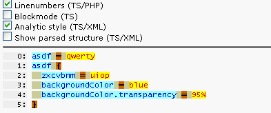
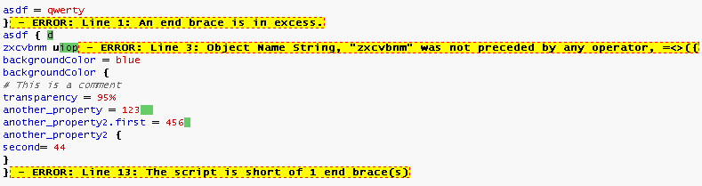

.. ==================================================
.. FOR YOUR INFORMATION
.. --------------------------------------------------
.. -*- coding: utf-8 -*- with BOM.

.. include:: ../../Includes.txt

Syntax highlighting and debugging
^^^^^^^^^^^^^^^^^^^^^^^^^^^^^^^^^

Syntax highlighting of TypoScript code is done by various analysis
applications in TYPO3 like the Template Analyzer for TypoScript
Templates or the User Admin module or Page TSconfig function in the
Info module. These typically allows you to view the TypoScript in each
context highlighted with syntax.

Here is an example from Page TSconfig as you can view it in the Info
module:

.. figure:: ../../Images/DetailsTSconfigHighlighting.png
   :alt: An extract from the Page TSconfig field as seen in the Info module.

In the extension "extdeveval" you will also find a tool, "Code
highlighting", which can analyze TypoScript code ad hoc. This is what
you get, when you just press the TypoScript button:

.. figure:: ../../Images/DetailsExtdeveval1.png
   :alt: The interface of extdeveval with some TypoScript code and a few
         buttons.

There are various modes of display:

The analytic mode (displayed above) colors all parts of the syntax:

- **Light blue** background: Object and property names

- **Yellow** background: Values

- **Olive green** background: Whitespace

- **Brown** background: Operators

Another mode is the "Block mode", which simply indents the TypoScript
code:

.. figure:: ../../Images/DetailsExtdeveval2.png
   :alt: The interface of extdeveval with some more TypoScript code and a
         few buttons.

Finally you will be warned if syntax errors are found and ignored data
will also be highlighted in green:

         ignored data.

Debugging
"""""""""

Debugging TypoScript for syntax errors can be done with this tool and
any other place where the syntax highlighter is used. But this will
only tell you if something is *syntactically* wrong with the code -
whether you combine objects and properties *semantically* correctly
depends on the context and cannot be told by the TypoScript parser
itself.

The TYPO3 system extension "t3editor" offers advanced functions, which
can also be useful for debugging. Its auto-completion functionality
for example only offers properties to be chosen, which in fact are
semantically allowed at a certain place. Currently t3editor is
available when editing the Setup field of a TypoScript template – not
for Page TSconfig or User TSconfig (writing summer 2011).

