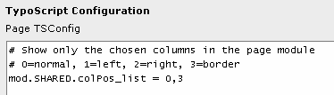
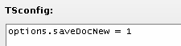
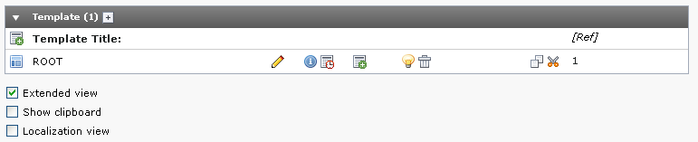
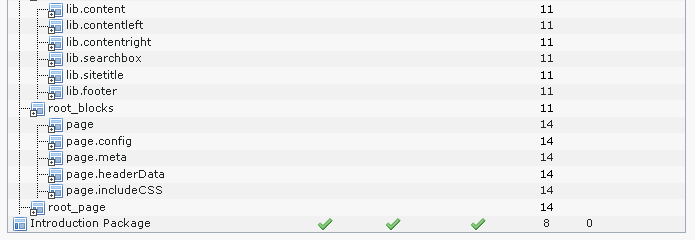

.. ==================================================
.. FOR YOUR INFORMATION
.. --------------------------------------------------
.. -*- coding: utf-8 -*- with BOM.

.. include:: ../../Includes.txt

.. _typoscript-usages:

Where is TypoScript used?
^^^^^^^^^^^^^^^^^^^^^^^^^

This question cannot be answered completely since this document only
describes the syntax of TypoScript and not any of the contexts where
TypoScript syntax is applied for configuration; theoretically anyone
could use the TypoScript parser class in TYPO3 to generate
configuration for their own local extensions using their own local
"semantics".

But at least we can mention the three main applications of the
TypoScript syntax as used in the core parts of TYPO3:

- **Page TSconfig:** Customization of branches of the page tree.

- **User TSconfig:** Customization of users and their groups.

- **TypoScript Templates:** Definition and customization of each website
  found in the page tree.

.. _details-page-tsconfig:

Page TSconfig
"""""""""""""

**Each page record in TYPO3 has a field where you can enter "TSconfig
code".** The main idea with Page TSconfig is that you can configure
individual behavior for separate parts of the page tree. This is
possible because the TypoScript code entered in the TSconfig fields is
accumulated for all pages in the root line of the current position in
the page tree starting from the root and going outwards. Thus
TypoScript settings in TSconfig fields of outer pages can override
those settings of pages closer to the root.

For instance you may have two separate websites located in separate
branches of the page tree. The one website might support content from
only the "normal" column while the other website supports it for both
the "normal" and "border" column. Since the Page module by default
shows all four possible columns you may want to instruct the page
module to show only the normal column and normal + border column
respectively. But this will only be possible if you can somehow tell
the system that from this page and outwards, use only "normal" column
and from that page and outwards use only "normal" + "border" column.
So in the root page of the two-column website you enter this line in
the TSconfig field:

And likewise for the one-column website you enter this value in the
TSconfig field of the root page:

.. figure:: ../../Images/DetailsPageTSconfigColPosList1Column.png
   :alt: The TSconfig field of a page with a configuration for one column.

For any subpage of the root page where the configuration was entered
the "Page" module will receive the value of the property
"colPos\_list". Accordingly only the configured columns will be shown.

The objects and properties you can use here are generally defined in
the document "TSconfig" in addition to local extension documents.

.. _details-user-tsconfig:

User TSconfig
"""""""""""""

**Each frontend and backend user and group has a field for input of
TSconfig code.** The main idea with User TSconfig is that you can
configure individual behavior for groups and even users themselves.
This gives you the possibility to set values, which are very detailed,
much more detailed than what you want to set as permission settings in
the main forms for users/groups. For instance you could configure how
many clipboard pads a user should see or whether a "Save document and
add new" button should appear for all forms for this user - stuff
which is clearly too detailed for a spot in the main form for
permissions and settings.

Like with Page TSconfig the content of the TSconfig fields are
accumulated in a certain order; the order of member groups and finally
the users own fields settings. Thus a setting for a user will override
the setting for one of his member groups.

Here is an example of what you can do with User TSconfig for a backend
user. This line will enable the "Save document and create new" button
in editing forms:

         "Save and New" button.

The objects and properties you can use here are generally defined in
the document ":ref:`TSconfig <t3tsconfig:start>`" in addition to local
extension documents.

.. _details-typoscript-templates:

TypoScript Templates
""""""""""""""""""""

**The most (in)famous and extensive use of TypoScript is in TypoScript
Templates for the frontend engine.** There TypoScript is used to
configure how the frontend engine will put together the website
output.This is probably also where TypoScript clashes most with
traditional ideas of template building in web design and confuses
people to think of TypoScript as a programming language - with the
result that they find it even more confusing. (If TYPO3 has a
scripting language it is *not* TypoScript but PHP!)

This introduction to TypoScript tries to eliminate this confusion.
Therefore let us make two statements about how TYPO3 handles
templates:

- **No fixed template method:** TYPO3 does *not* offer *one fixed way*
  to dealing with templates for websites; rather you are *set free* to
  choose the way *you* find most appealing. You can use:

  - **HTML templates:** Configure TYPO3 to facilitate external HTML-
    templates with markers and subparts. Popular and familiar for most
    people. Please see the ":ref:`Templating Tutorial
    <t3templating:start>`".

  - **Fluid templates:** Configure TYPO3 to use extbase and fluid
    (available as system extensions since TYPO3 4.3) for templating. This
    allows to use external HTML templates, but with fluid-style variables
    with curly braces. Since TYPO3 4.5 a new content object
    "FLUIDTEMPLATE" is available, which that way lets you use fluid from
    inside TypoScript.

  - **External Templating Engines:** Configure TYPO3 to use XSLT
    stylesheets with an XSLT processor. This is done either by an
    extension providing this functionality or by writing your own
    extension for it.

  - **Custom PHP:** Configure TYPO3 to call your own PHP code which
    generates content in any way you may prefer. This might include using
    third party templating engines!

  - **TS content objects:** Build the page by the "content objects" of the
    Frontend Engine. These cObjects are *accessible/programmable* through
    the TypoScript syntax.

- **TypoScript Templates *determine* the method:** No matter
  which template method (see list above) you would like to use TYPO3
  needs to be told *which one*! And *this* is what the TypoScript
  Template does first and foremost; it is used to configure basic and
  advanced behaviors of the frontend engine so that the site rendering
  gets done.

A TypoScript Template works a little like the Page TSconfig; it is a
database record attaching its TypoScript content to a certain page and
from that page and outwards the configuration contained in the
TypoScript will affect the pages until a new template record is found
which overrides properties from earlier in the tree. Thus TypoScript
Template records are effectively defining which page is the root page
of a website:

TypoScript Templates contain a field for the TypoScript configuration
code ("Setup" field) but a template record like the one in the picture
above ("Introduction Package") can also contain references to other
template records and files which contain predefined generally useful
TypoScript code which is included and thus reusable/sharable across
templates. The order of included TypoScript template records/files can
be seen visually with the Template Analyzer, which you find inside the
"Template" module in the backend (if it is not there, install the
system extension "tstemplate\_analyzer"):

To get more background knowledge about how TypoScript templates work,
please read the section ":ref:`typoscript-templates`". To read about
all standard objects and properties which you can use in building
TypoScript templates you should refer to the TypoScript reference -
TSref. For practical examples or when you want to learn by doing, look
at the Getting Started manual.

