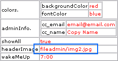

.. ==================================================
.. FOR YOUR INFORMATION
.. --------------------------------------------------
.. -*- coding: utf-8 -*- with BOM.

.. include:: ../../Includes.txt

.. _implementing-custom-conditions:

Implementing custom conditions
^^^^^^^^^^^^^^^^^^^^^^^^^^^^^^

Now we know how to parse TypoScript and the only thing we still want
to do is to implement support for custom conditions. As stated a few
places *the evaluation* of a condition is external to TypoScript and
all you need to do in order to have an external process deal with
conditions is to pass an object as the second parameter to the parse-
function. This is done in the code listing below::

      1: require_once(PATH_t3lib.'class.t3lib_tsparser.php');
      2:
      3: class myConditions {
      4:   function match($conditionLine) {
      5:     if ($conditionLine === '[TYPO3 IS GREAT]') {
      6:       return TRUE;
      7:     }
      8:   }
      9: }
     10: $matchObj = t3lib_div::makeInstance('myConditions');
     11:
     12: $TSparserObject = t3lib_div::makeInstance('t3lib_tsparser');
     13: $TSparserObject->parse($tsString, $matchObj);
     14:
     15: debug($TSparserObject->setup);

Here go some notes to this listing:

- Lines 3-10 define a very simple class with a function, match(),
  inside.The function "match()" must exist and take a string as its
  argument and the match function must also return a boolean value. This
  function should be programmed to evaluate the condition line according
  to your specifications.Currently, if a condition line contains the
  value "[TYPO3 IS GREAT]" then the condition will evaluate to true and
  the subsequent TypoScript will be parsed.

- Line 13: Here the instantiated object, $matchObj, of the
  "myConditions" class is passed to the parser.

- Line 15: Just a little side note: Instead of using PHPs "print\_r()"
  function we use the classic debug() function in TYPO3 which prints an
  array in an HTML table - some of us think this is the nicest way to
  look into the content of an array (make your own opinion from the
  screenshot below).

Anyways, let's test the custom condition class from the code listing
above. This is done by parsing this TypoScript code::

      0: someOtherTS = 123
      1:
      2: [TYPO3 IS GREAT]
      3:
      4: message = Yes
      5: someOtherTS = 987
      6:
      7: [ELSE]
      8:
      9: message = No
     10:
     11: [GLOBAL]
     12:
     13: someTotallyOtherTS = 456

With this listing we would expect to get the object path "message" set
to "Yes" since the condition line "[TYPO3 IS GREAT]" matches the
criteria for what will return true. Lets try:

.. figure:: ../../Images/ParserAPIConditionDebug1.png
   :alt: Debug output of our custom condition 1.

According to this output it worked!

Lets try to alter line 2 to this::

      1:
      2: [TYPO3 IS great]
      3:

The parsed result is now:

.. figure:: ../../Images/ParserAPIConditionDebug2.png
   :alt: Debug output of our custom condition 2.

As you can see the value of "message" is now "No" since the condition
returned FALSE. The string "[TYPO3 IS great]" is obviously *not* the
same as "[TYPO3 IS GREAT]"! The value of "someOtherTS" was also
changed to "123" which was the value set before the condition and
since the condition was not TRUE the overriding of that former value
did not happen like in the first case.

.. _custom-conditions-example:

A realistic example
"""""""""""""""""""

Most likely you don't want to evaluate conditions based on their bare
string value. More likely you want to set up rules for a syntax and
then parse the condition string. One example could be this modified
condition class which will implement support for the condition seen in
the TypoScript listings in the former section, "[UserIpRange =
123.456.\*.\*]"::

      1: class myConditions {
      2:   function match($conditionLine) {
      3:       // Getting the value inside of the square brackets:
      4:     $insideSqrBrackets = trim(ereg_replace('\]$', '', substr($conditionLine, 1)));
      5:
      6:       // Splitting value into a key and value based on the "=" sign
      7:     list($key, $value) = explode('=', $insideSqrBrackets, 2);
      8:
      9:     switch(trim($key)) {
     10:       case 'UserIpRange':
     11:         return t3lib_div::cmpIP(t3lib_div::getIndpEnv('REMOTE_ADDR'), trim($value)) ? TRUE : FALSE;
     12:       break;
     13:       case 'Browser':
     14:         return $GLOBALS['CLIENT']['BROWSER'] == trim($value);
     15:       break;
     16:     }
     17:   }
     18: }

This class works in this way:

- Line 4: The square brackets in the start (and possibly end as well) of
  the condition line is removed.

- Line 7: The condition line without square brackets is exploded into a
  key and a value separated by the "=" sign; we are trying to implement
  the concept of evaluating a data source to a value.

- Line 9-16: This switch construct will allow the "key" to be either
  "UserIpRange" or "Browser" (the datasource pointer) and the value
  after the equal sign is of course interpreted accordingly.

Lets try and parse the TypoScript listing from the former section::

      0: colors {
      1:   backgroundColor = red
      2:   fontColor = blue
      3: }
      4: adminInfo {
      5:   cc_email = email@email.com
      6:   cc_name = Copy Name
      7: }
      8: showAll = true
      9:
     10: [UserIpRange = 123.456.*.*]
     11:
     12:   headerImage = fileadmin/img1.jpg
     13:
     14: [ELSE]
     15:
     16:   headerImage = fileadmin/img2.jpg
     17:
     18: [GLOBAL]
     19:
     20:   // Wonder if this works... :-)
     21: wakeMeUp = 7:00

The result of parsing this will be an array like this:

As you can see the "headerImage" property value stems from the [ELSE]
condition section and thus the "[UserIpRange = 123.456.\*.\*]" must
still have evaluated to FALSE - which is actually no wonder since
nobody can have the IP address range "123.456.\*.\*"!

Lets change line 10 of the TypoScript to this::

      9:
     10: [UserIpRange = 192.168.*.*]
     11:

Since I'm currently on an internal network with an IP number which
falls into this space, the condition should now evaluate to TRUE when
the TypoScript is parsed:

... and in fact it does!

