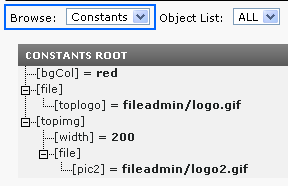

.. ==================================================
.. FOR YOUR INFORMATION
.. --------------------------------------------------
.. -*- coding: utf-8 -*- with BOM.

.. include:: ../../Includes.txt

.. _constants:

Constants
^^^^^^^^^

.. _what-are-constants:

What are constants?
"""""""""""""""""""

Constants are values defined in the "Constants"-field of a template.
They follow the syntax of ordinary TypoScript!

**Note, reserved name:** The object or property "file" is always
interpreted as data type ":ref:`resource
<t3tsref:data-type-resource>`". That means it refers to a file, which
you have to upload in your TYPO3 installation.

**Note: The top-level "object" TSConstantEditor** cannot be used. It's
reserved for configuration of the Constant Editor module.

Example:
~~~~~~~~

Here "bgCol" is set to "red", "file.toplogo" is set to
"fileadmin/logo.gif" and "topimg.file.pic2" is set to
"fileadmin/logo2.gif"; these files must be uploaded in your
installation.

.. code-block:: ts
   :emphasize-lines: 3,4

   bgCol = red
   topimg.width = 200
   topimg.file.pic2 = fileadmin/logo2.gif
   file.toplogo = fileadmin/logo.gif

This could also be defined in other ways, e.g. like this:

.. code-block:: ts
   :emphasize-lines: 2,7

   bgCol = red
   file {
     toplogo = fileadmin/logo.gif
   }
   topimg {
     width = 200
     file.pic2 = fileadmin/logo2.gif
   }

(The objects in the highlighted lines contain the reserved word "file"
and the properties are always of data type ":ref:`resource
<t3tsref:data-type-resource>`".)

