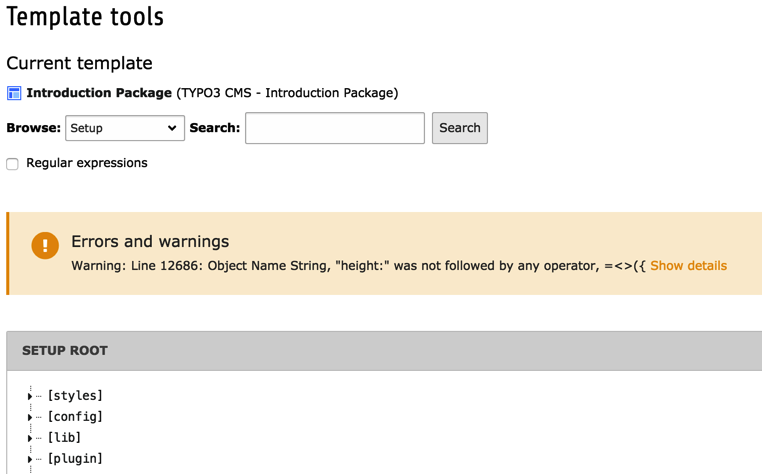

.. include:: ../../Includes.txt

.. _templates-debugging:
.. _debugging:

Debugging
^^^^^^^^^

There are no tools that will tell you that your TypoScript code is
100% correct. The TypoScript Object Browser will warn you about syntax errors
though:

Errors will also appear in the Template Analyzer, when viewing the
content of a give template. It is also possible to see the full
TypoScript code by clicking on the "View the complete TS listing"
button at the bottom of the Template Analyzer:

.. figure:: ../../Images/TemplatesViewFullListingButton.png
   :alt: The TypoScript Object Browser showing a syntax error

The result is a long listing with all compiled line numbers, which
makes it easy to find the error reported by the TypoScript Object Browser.

.. figure:: ../../Images/TemplatesFullListing.png
   :alt: The TypoScript Object Browser showing a syntax error

In the frontend, the Admin Panel is another possibility to debug
TypoScript; use its section called "TypoScript"! It shows you selected
rendered (configuration) values, SQL queries, error messages and more.

TypoScript itself offers a number of debug functions:

- :ref:`stdWrap <t3tsref:stdwrap>` comes with the properties
  :ref:`debug <t3tsref:stdwrap-debug>`, :ref:`debugFunc <t3tsref:stdwrap-debugfunc>` and
  :ref:`debugData <t3tsref:stdwrap-debugdata>` which help checking which values
  are currently available and which configuration is being handled.

- :ref:`GMENU <t3tsref:gmenu>`, :ref:`TMENU <t3tsref:tmenu>` and
  :ref:`IMGMENU <t3tsref:imgmenu>` come with the property
  :ref:`debugItemConf <t3tsref:menu-common-properties>`. If set
  to "1", it outputs the configuration arrays for each menu item.
  Useful to debug :ref:`optionSplit <t3tsref:objects-optionsplit>`
  things and such.
