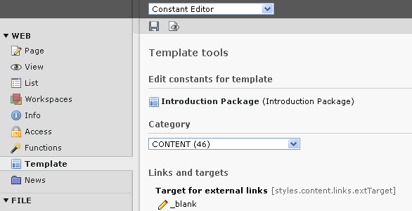
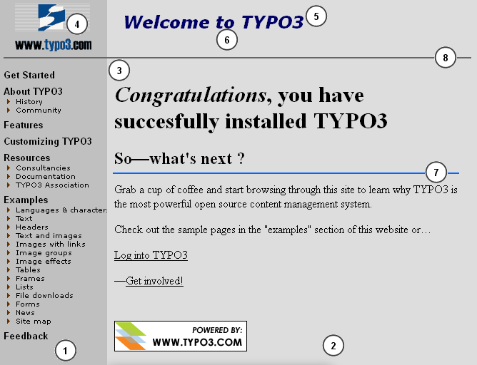

.. ==================================================
.. FOR YOUR INFORMATION
.. --------------------------------------------------
.. -*- coding: utf-8 -*- with BOM.

.. include:: ../../Includes.txt

.. _constant-editor:

Declaring constants for the Constant Editor
^^^^^^^^^^^^^^^^^^^^^^^^^^^^^^^^^^^^^^^^^^^

You can put comments anywhere in your TypoScript. Comments are always
ignored by the parser when the template is processed. But the backend
module Web > Template has the ability to utilize comments in the
constant editor that makes simple configuration of a template even
easier than constants already make it themselves.

When the TypoScript "Constant Editor" parses the template, *all*
comments before every constant-definition are registered. You can
follow a certain syntax to define what category the constant should be
in, which type it has and what explanation there is about the
constant. This is an example containing several constant definitions::

   styles.content.textStyle {
       # cat=content/cText/1; type=; label= Bodytext font: This is the font face used for text!
     face =
       # cat=content/cText/2; type=int[1-5]; label= Bodytext size
     size =
       # cat=content/cText/3; type=color; label= Bodytext color
     color =
     color1 =
     color2 =
     properties =
   }

It's totally optional to make the comments before your constants
compliant with this system, but it's very useful later on if you want
others to make simple corrections to your template or distribute the
template in a template-archive or such.

.. _constant-editor-default-values:

Default values:
"""""""""""""""

The default value of a constant is determined by the value the
constant has BEFORE the last template (the one you're manipulating
with the module) is parsed (previous templates are typically included
static\_template records!), unless the mark
###MOD\_TS:EDITABLE\_CONSTANTS### is found in the last template, in
which case constant-definitions before this mark are also regarded
default-values.

This means that all constant values - or values after the mark
###MOD\_TS:EDITABLE\_CONSTANTS### if present - in the template record
you're manipulating are regarded to be your customized extensions.

.. _constant-editor-comments:

Comments:
"""""""""

How the comments are perceived by the module:

- All comments set on lines before the constant wherever it's found in
  the templates are parsed sequentially.

- Each line is split by the ";" (semicolon) character, that separates
  the various parameters

- Each parameter is split by the "=" (equal) sign to separate the
  parameter "key" and the "value".

.. _constant-editor-keys:

Keys:
"""""

cat=
~~~~

- Comma-separated list of the categories (case-insensitive) that the
  constant is a member of. You should *list only one category*,
  because it usually turns out to be confusing for users, if one and the
  same constant appears in multiple categories!

- If the chosen category is *not* found among the default categories
  listed below, and is not a custom category either, it's regarded a new category.

- If the category is empty (""), the constant is excluded from the
  editor!

**Predefined Categories**

.. ### BEGIN~OF~SIMPLE~TABLE ###

=========  ======================================================================
Category   Description
=========  ======================================================================
basic      Constants of superior importance for the template-layout. This is
           dimensions, image files and enabling of various features. The most
           basic constants, which you would almost always want to configure.
menu       Menu setup. This includes font files, sizes, background images.
           Depending on the menu type.
content    All constants related to the display of page content elements.
page       General configuration like meta tags, link targets.
advanced   Advanced functions, which are used very seldom.
=========  ======================================================================

.. ###### END~OF~SIMPLE~TABLE ######

**Custom Categories**

To define your own category put a comment including the parameter
"customcategory". Here is an example::

   # customcategory=mysite=LLL:EXT:myext/locallang.xlf:mysite

This line defines the new category "mysite" which will be available
for your Constants defined AFTER this line. Usage example::

   #cat=mysite//a; type=boolean; label=Global no_cache
   config.no_cache = 0

**Subcategories:**

There are a number of subcategories to use. Subcategories are entered
after the category-name separated by a slash "/". Example:
"basic/color/a"

This will make the constant go into the "BASIC"-category, be listed
under the "COLOR"-section and probably be one of the top-constants
listed, because the "a" is used to sort the constants in a
subcategory. If "a" was not entered, the default is "z" and thus it
would be one of the last colors to select. As the third parameter
here, you can choose whatever you like.

You can use one of the predefined subcategories or define your own. If
you use a non-existing subcategory, your constant will just go into
the subcategory "Other".

**Predefined Subcategories**

Standard subcategories (in the order they get listed in the Constant
Editor):

.. ### BEGIN~OF~SIMPLE~TABLE ###

===========  ============
Subcategory  Description
===========  ============
enable       Used for options that enable or disable primary functions of a
             template.
dims         Dimensions of all kinds; pixels, widths, heights of images, frames,
             cells and so on.
file         Files like background images, fonts and so on. Other options related
             to the file may also enter.
typo         Typography and related constants.
color        Color setup. Many colors will be found with related options in other
             categories though.
links        Links: Targets typically.
language     Language specific options.
===========  ============

.. ###### END~OF~SIMPLE~TABLE ######

Subcategories based on the default content elements

cheader,cheader\_g,ctext,ctextpic,cimage,cbullets,ctable,cuploads,cmul
timedia,cmailform,csearch,clogin,csplash,cmenu,cshortcut,clist,cscript
,chtml

These are all categories reserved for options that relate to content
rendering for each type of tt\_content element. See static\_template
"css_styled_content" for examples.

**Custom Subcategories**

To define your own Subcategory put a comment including the parameter
"customsubcategory". Here is an example::

   # customsubcategory=cache=LLL:EXT:myext/locallang.xlf:cache

This line defines the new Subcategory "cache" which will be available
for your Constants defined AFTER this line. Usage example::

   #cat=Site conf/cache/a; type=boolean; label=Global no_cache
   config.no_cache = 0

Will look in the Constant Editor like this:

.. figure:: ../../Images/TSTemplatesCustomSubcategory.png
   :alt: The Constant Editor showing a custom category.

type=
~~~~~

.. ### BEGIN~OF~SIMPLE~TABLE ###

===========================  ============================================================================
Type                         Description
===========================  ============================================================================
int [low-high]               Integer, opt. in range "low" to "high"
int+                         Positive integer
offset [L1,L2,...L6]         Comma-separated list of integers. Default is "x,y", but as comma separated
                             parameters in brackets you can specify up to 6 labels being comma
                             separated! If you wish to omit one of the last 4 fields, just don't
                             enter a label for that element.
color                        HTML color
wrap                         HTML code that is wrapped around some content.
options [item1,item2,...]    Selectbox with values/labels item1, item2 etc. Comma-separated. Split
                             by "=" also and in that case, first part is label, second is value
boolean [truevalue]          Boolean, opt. you can define the value of "true", def.=1
comment                      Boolean, checked= "", not-checked = "#".
file [ext-list/IMAGE\_EXT]   Selectorbox with resources. Opt. list allowed extensions (no space in
                             list!), e.g. "[ttf]" or "[txt,html,htm]". You can also enter
                             "[IMAGE\_EXT]" in which case the default image-extensions are listed.
                             (used for data type "imgResource")
string (the default)         Just a string value
user                         Path to the file and method which renders the option HTML.
                             e.g. type=user[EXT:extension/path/file.php:Vendor\Extension\Namespace\ClassName->method]
===========================  ============================================================================

.. ###### END~OF~SIMPLE~TABLE ######

label=
~~~~~~

Text string, trimmed.

Split by the first ":" to separate a header and body of the comment.
The header is displayed on it's own line in bold.

This can be localized by using the traditional "LLL" syntax. Example::

   #cat=Site conf/cache/a; type=boolean; label=LLL:EXT:examples/locallang.xlf:config.no_cache
   config.no_cache = 0

Note that a single string is referenced (not one for the header and
one for the description). This means that the localized string must
contain the colon separator (":"). Example::

   <trans-unit id="config.no_cache" xml:space="preserve">
     <source>Global no_cache: Check the box to turn off all caches.</source>
   </trans-unit>

.. _constant-editor-categories:

TSConstantEditor.[category]
"""""""""""""""""""""""""""

In addition to using constants, you can also configure a category in
the constant editor by a special top-level TypoScript "object" in the
*constants* -field. The name is "TSConstantEditor" and any properties
to this object will NOT be substituted like any other constant
normally would.

.. ### BEGIN~OF~TABLE ###

.. container:: table-row

   Property
         header

   Data type
         string

   Description
         Header, displayed in upper-case.

.. container:: table-row

   Property
         description

   Data type
         string, break by //

   Description
         Description, enter "//" to create a line break.

.. container:: table-row

   Property
         bulletlist

   Data type
         string, break by //

   Description
         Lines for a bulletlist, enter "//" (double-slash) in order to break to
         next bullet.

.. container:: table-row

   Property
         image

   Data type
         image

   Description
         This is an optional image you can attach to the category.

         The image would normally show a given configuration of the template
         and contain numbered marks, that indicate positions that are referred
         to by the constants, listed in the number-array.

         The image must be located in "gfx/" in the module path.

.. container:: table-row

   Property
         Array, 1-20

   Data type
         list of constant names

   Description
         Each number refers to a number-mark on the image and all constants
         that are listed at each number will get a little number-icon by it's
         header.

.. ###### END~OF~TABLE ######

[TSConstantEditor.[category]]

Example:
~~~~~~~~

::

   ## TSConstantEditor Configuration
   TSConstantEditor.basic {
     header = Standard Template "BUSINESS"
     description = BUSINESS is a frame-based template in a very simple layout, based on ....
     bulletlist = Left-frame image in the top. The dimensions are fixed to ....
     image = gfx/BUSINESS_basic.gif

     1 = leftFrameWidth,menu.file.bgImg,menu.bgCol
     2 = page.file.bgImg,bgCol
     3 = contentOffset
     4 = file.logo
     5 = page.L0.titleWrap
     6 = page.L1.titleWrap
     7 = contentWidth,styles.content.imgtext.maxW
     8 = page.lineCol
   }

This example shows how the static template "BUSINESS", which you find
in the extension "statictemplates", is configured for the
**basic**-module.

The Business template is frame-based and has a very simple layout. It
has a 2-level textual menu. You can select the properties of the font
tag like the font size, color and so on. Details are in the following
list. The numbers in brackets fit to the numbers in the code example
above and in the screenshot below.

- You can define the background images for each frame, the left and the
  page frame). The width of the left frame can also be selected. (1) and
  (2)

- You can set the offset of the content from the left frame and from the
  top. (3)

- You can choose a logo for the top of the left frame. The dimensions
  are fixed to 150x80 pixels (normally you are free to choose the
  dimensions yourself). (4)

- The page titles from first level (5) and second level (none in the
  screenshot) (6) are displayed at the top.

- You can choose the width of the content block. (7)

- You can pick a color for the ruler at the top. (8)

This is how it looks like in TYPO3 by default:

