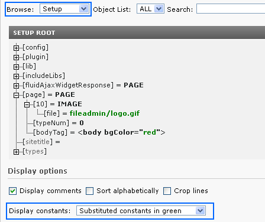

.. ==================================================
.. FOR YOUR INFORMATION
.. --------------------------------------------------
.. -*- coding: utf-8 -*- with BOM.

.. include:: ../../Includes.txt

Using constants
^^^^^^^^^^^^^^^

Constants are inserted in the template-setup by performing an ordinary
str\_replace operation! You insert them in the setup field like this::

   {$bgCol}
   {$topimg.width}
   {$topimg.file.pic2}
   {$file.toplogo}

Example:
""""""""

::

   page = PAGE
   page.typeNum = 0

   page.bodyTag = <body bgColor="{$bgCol}">
   page.10 = IMAGE
   page.10.file = {$file.toplogo}

**Only constants, which are defined** in the "Constants" field, are
substituted. So for our example to work, we again have to define the
constants from the last example in the constants field.

Remember that in the constants field you can **reference files
without giving a file path** (like we did for logo.gif). For the
replacement to work, you must upload these files in the resources
section of the template.

Constants in included templates are also substituted as the whole
template is just one large chunk of text.

Constants are case sensitive.

You should use a systematic naming scheme for constants. Seek
inspiration in the code examples around.

Notice how the constants in the setup code are substituted (marked in
green). In the Object Browser, you can monitor the constants with or
without substitution. Also notice that the value "logo.gif" was
resolved to the resource "uploads/tf/logo.gif"

(Note: The "Display constants" function is not available if you select
"Crop lines".)

