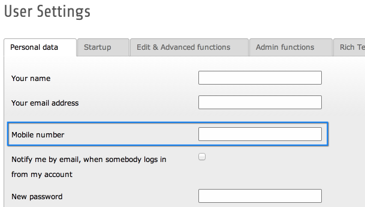

.. include:: ../../Includes.txt

.. _user-settings-extending:

Extending the User Settings
^^^^^^^^^^^^^^^^^^^^^^^^^^^

Adding fields to the User Settings is done in two steps.
First of all, the new fields are added directly to the
:code:`$GLOBALS['TYPO3_USER_SETTINGS']` array. Then the
field is made visible by calling
:code:`\TYPO3\CMS\Core\Utility\ExtensionManagementUtility::addFieldsToUserSettings()`.

Here is an example, taken from the "examples" extension:

.. code-block:: php

   $GLOBALS['TYPO3_USER_SETTINGS']['columns']['tx_examples_mobile'] = array(
      'label' => 'LLL:EXT:examples/Resources/Private/Language/locallang_db.xlf:be_users.tx_examples_mobile',
      'type' => 'text',
      'table' => 'be_users',
   );
   \TYPO3\CMS\Core\Utility\ExtensionManagementUtility::addFieldsToUserSettings(
      'LLL:EXT:examples/Resources/Private/Language/locallang_db.xlf:be_users.tx_examples_mobile,tx_examples_mobile',
      'after:email'
   );

The second parameter in the call to :code:`addFieldsToUserSettings()`
is used to position the new field. In this example, we decide to add it
after the existing "email" field.

In this example the field is also added to the "be_users" table. This is
not described here as it belongs to 'extending the $TCA array'.
See label 'extending' in older versions of the TCA-Reference.

And here is the new field in the User Tools > User Settings module:

   The new field visible in the User Settings configuration
